# ***모놀리스 배포를 위한 `GitOps` 설정***

비록 레거시 모놀리스 애플리케이션이지만 클라우드로 전환하면서 `컨테이너화 (Containerization)`를 완료하였으며 `GitOps`도 적용하여 최종 배포도 `ArgoCD`를 통해 수행하게 됩니다.

이번에는 `ArgoCD` 배포를 위한 `GitOps` 리포지터리를 우선 설정하도록 하겠습니다.

---

## 1. 모놀리스 `GitOps` 리포지터리 초기화

1. `Cloud9` 터미널 창에서 다음 명령을 실행하여 `GitOps` 리포지터리를 초기화합니다.

```bash
cd ~/environment/legacy-application-modernization
rm -rf .git

# 어플리케이션 Helm Artifact 경로로 이동
cd ~/environment/legacy-application-modernization/legacy/applications/TravelBuddy/helm

# Git 연결
git init
git branch -M main

# GitOps 리포지터리 URL 확인
export HELM_CODECOMMIT_URL=$(aws codecommit get-repository --repository-name hotelspecials-configuration --region ap-northeast-2 | grep -o '"cloneUrlHttp": "[^"]*' | grep -o '[^"]*$')
echo $HELM_CODECOMMIT_URL

# GitOps 배포 리포지터리와 연결
git remote add origin $HELM_CODECOMMIT_URL

# Git 스테이징 영역에 파일을 추가
git add .

# GitOps 리포지터리에 Push
git commit -am "First commit."
git push --set-upstream origin main
```

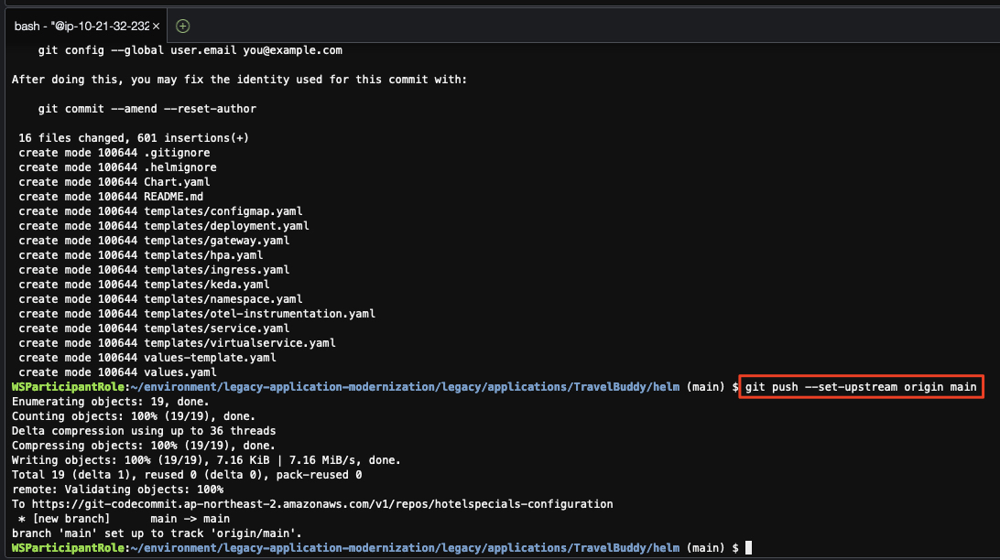

---

## 2. `ArgoCD` 접속

1. `ArgoCD` 접속 주소 확인

테라폼을 통해 쿠버네테스를 생성하는 과정에서 `ArgoCD`도 클러스터 내에 함께 배포되었습니다. 또한 `ArgoCD`가 참조하는 `GitOps` 리포지터리도 함께 생성되어 있습니다.

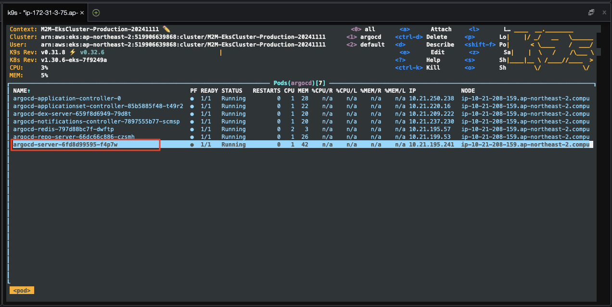

우리는 이 `ArgoCD`를 통하여 `GitOps`를 설정하고 애플리케이션을 배포할 것입니다. `ArgoCD`의 접속 주소는 다음 명령으로 확인할 수 있습니다.

```bash
# ArgoCD 접속 주소 확인
kcp
export ARGOCD_SERVER=`kubectl get ingress/argocd-server -n argocd -o json | jq --raw-output '.status.loadBalancer.ingress[0].hostname'`
echo https://$ARGOCD_SERVER
```

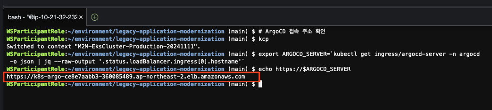

2. `ArgoCD` 접속

위에서 확인한 `ArgoCD` 접속 주소를 `Cloud9` 터미널에서 클릭하면 새로운 탭이 열리면서 `ArgoCD` 로그인 화면이 나타납니다.


> 📒 (참고)<br>
> `Self-signed` 인증서로 인해 브라우저에서 보안 경고가 나타날 수 있습니다. 이 경우 `고급` > `안전하지 않은 사이트로 이동` 혹은 `위험을 감수하고 계속`을 클릭하여 진행합니다.

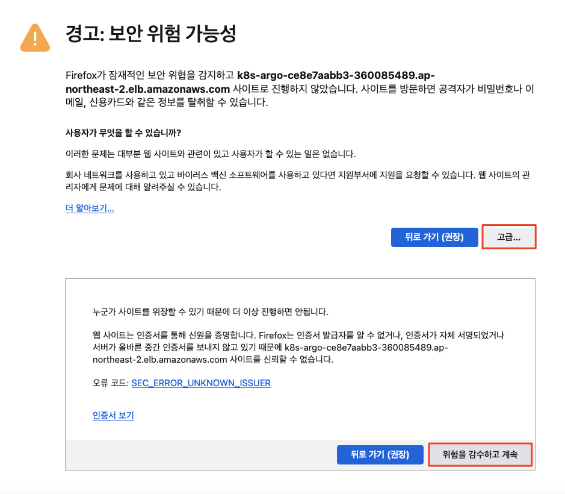

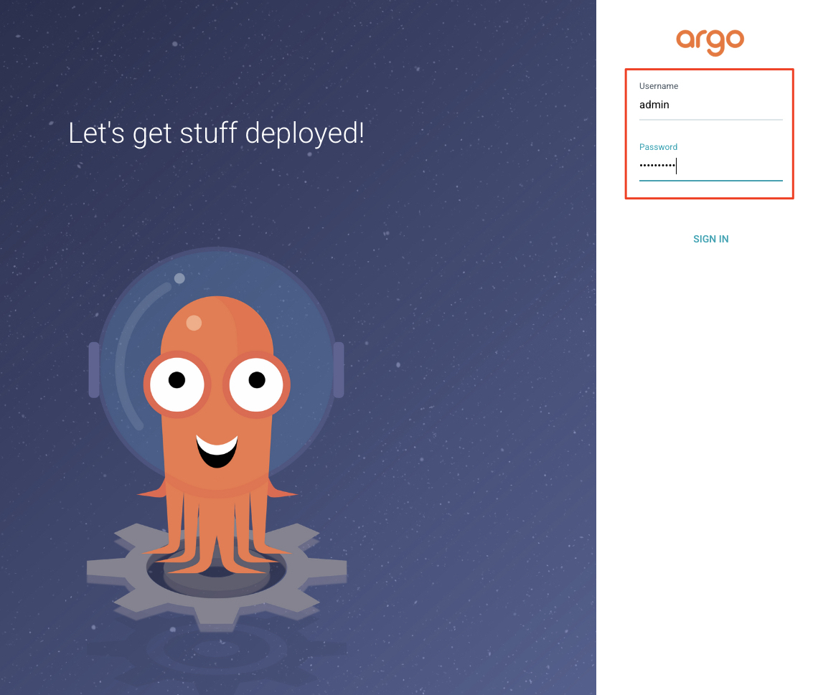

> 📌️ ArgoCD 접속 계정<br>
> * **Username**: `admin`
> * **Password**: `Abraca00#1`

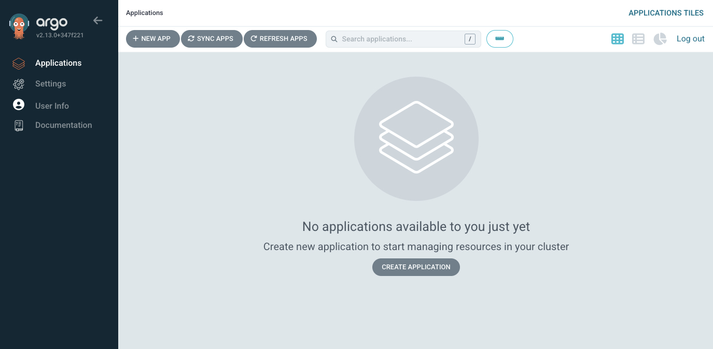

---

## 3. `ArgoCD`가 참조하는 `GitOps` 리포지터리 설정

1. `GitOps` 리포지터리 확인

`Cloud9` 터미널 창에서 다음 명령을 실행하여 `ArgoCD`가 참조하는 `GitOps` 리포지터리를 확인합니다.

```bash
export HELM_CODECOMMIT_URL=$(aws codecommit get-repository --repository-name hotelspecials-configuration --region ap-northeast-2 | grep -o '"cloneUrlHttp": "[^"]*'|grep -o '[^"]*$')
echo $HELM_CODECOMMIT_URL
```

> 📒 (참고)<br>
> 위에서 표시되는 `GitOps` 리포지터리 URL을 기록해 둡니다.

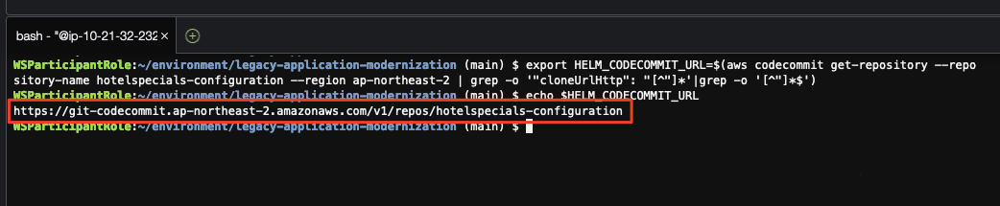

2. `GitOps` 리포지터리 접속을 위한 Credential 설정

위에서 확인한 `GitOps` 리포지터리에 `ArgoCD`가 접속하여 애플리케이션 배포 형상을 가져오기 위해서는 `CodeCommit` 리포지터리에 접근할 수 있는 `Credential` 설정이 필요합니다. 아래와 같이 수행합니다.

```bash
# IAM User 생성
aws iam create-user --user-name argocd 
# AWSCodeCommitPowerUser 관리형 권한 정책 연결 (arn:aws:iam::aws:policy/AWSCodeCommitPowerUser)
aws iam attach-user-policy --user-name argocd --policy-arn arn:aws:iam::aws:policy/AWSCodeCommitPowerUser
# CodeCommit 접근을 위한 Specific Credential 생성
# (중요) 결과로서 반환되는 "ServiceUserName"과 "ServicePassword"를 기록해 둡니다.
aws iam create-service-specific-credential --user-name argocd --service-name codecommit.amazonaws.com
```

> 📒 (참고)<br>
> 위 명령으로 표시되는 `ServiceUserName`과 `ServicePassword`를 기록해 둡니다.

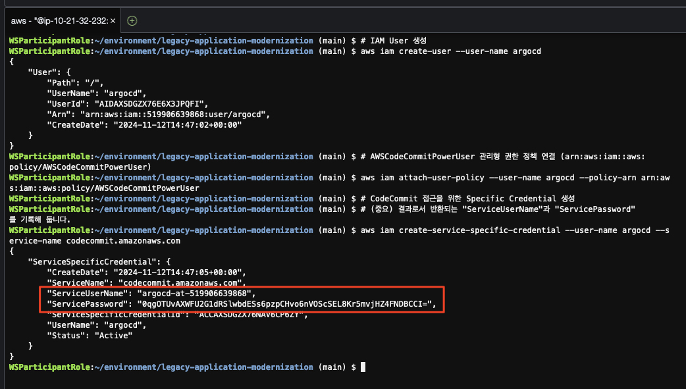

3. `ArgoCD`에 `GitOps` 리포지터리 추가

`ArgoCD` 화면에서 `GitOps` 리포지터리를 추가하기 위해 다음과 같이 수행합니다.

* "Settings" > "Repositories" > "Connect Repo"
* "Choose your connection method": `HTTPS`
* "Type": `git`
* "Project": `default`
* "Repository URL": <위에서 확인한 `GitOps` 리포지터리 URL을 입력>
* "Username": <위에서 생성한 `ServiceUserName`>
* "Password": <위에서 생성한 `ServicePassword`>
* "Connect" 버튼을 클릭하여 정상적으로 접속이 되는지 확인합니다.

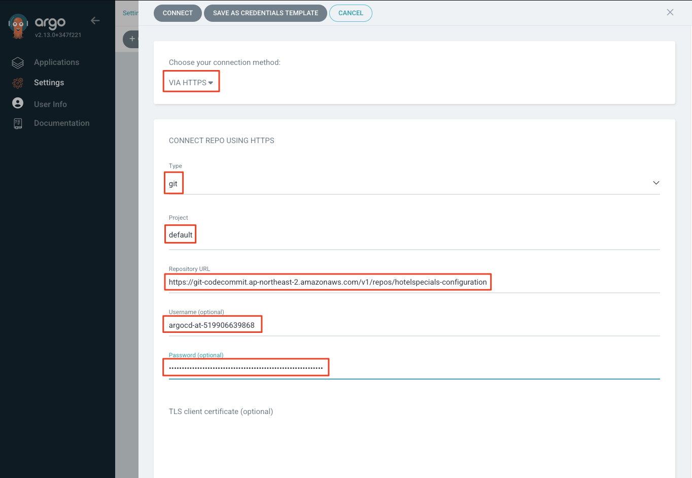

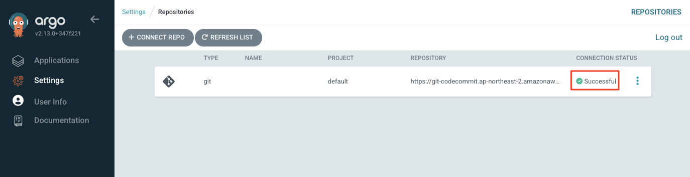

---

## 4. `ArgoCD` 애플리케이션 생성 (모놀리스)

다음 과정을 통해 `ArgoCD`를 통해 배포될 모놀리스 애플리케이션을 정의합니다.

1. `ArgoCD` 애플리케이션 생성

`ArgoCD` 화면에서 다음과 같이 애플리케이션을 정의합니다.

* "Applications" > "New App"
* "Application Name": `insurance-planning`
* "Project": `default`
* "Sync Policy": `Manual`
* "Repository URL": <앞서 설정한 리포지터리>
* "PATH": `.` (중요)
* "Destination" 섹션 > "Cluster URL": `https://kubernetes.default.svc`
* "Destination" 섹션 > "Namespace": `insurance` 입력
* "Helm Parameters" 값이 Populate되는지 확인
* `Create` 버튼을 클릭하여 애플리케션 정의를 생성합니다.

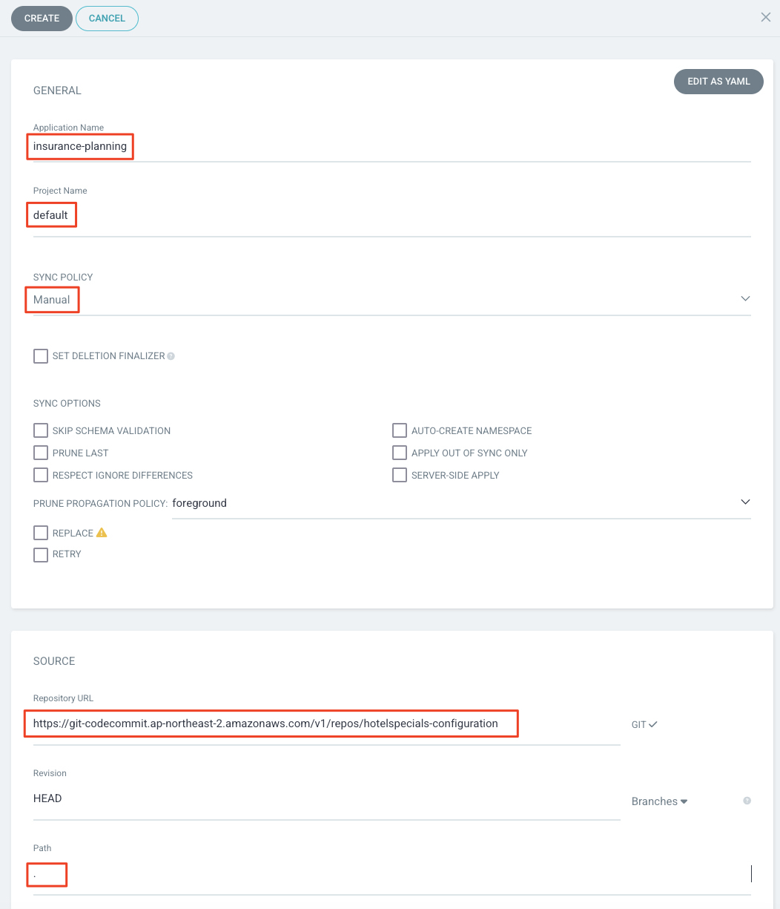

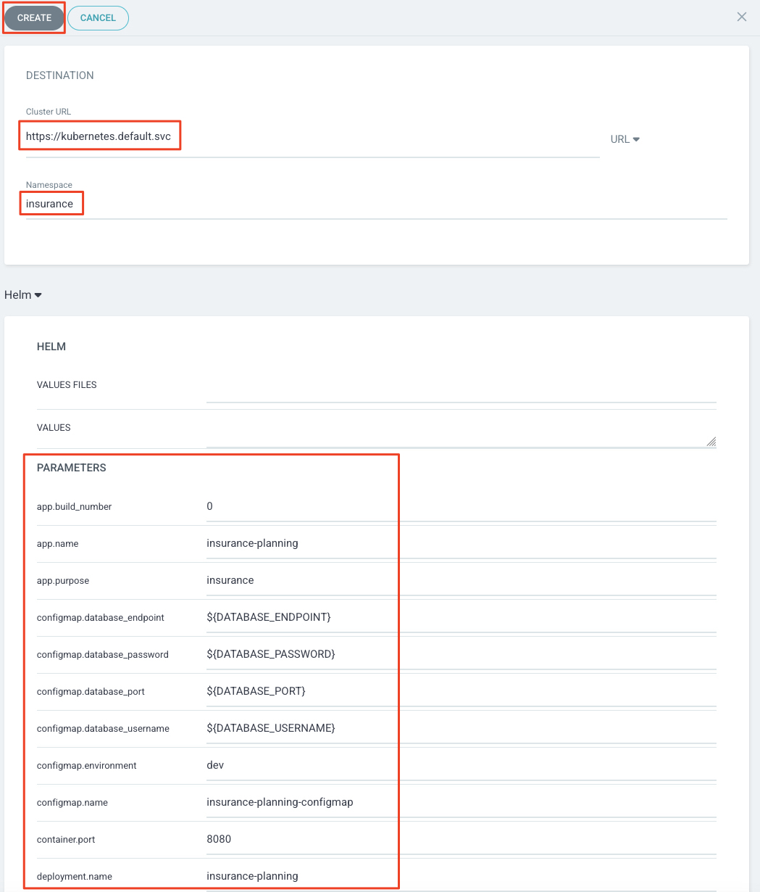

> 📒️ (참고)<br>
> `ArgoCD`에서 애플리케이션이 생성되면 아직 동기화가 되지 않았으므로 `OutOfSync`로 표시됩니다.<br>
> 이후 설정할 빌드 파이프라인이 잘 수행되면 `ArgoCD`에서 애플리케이션 배포가 자동으로 수행되고 `Synced`로 표시됩니다.

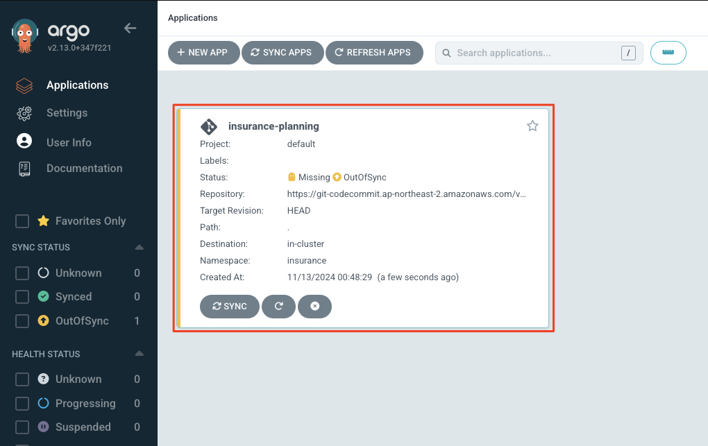

---

> 🎊 모놀리스 애플리케이션을 배포하는 `ArgoCD` 설정을 완료하였습니다. 이제 애플리케이션의 빌드 파이프라인을 설정하고 빌드를 진행한 후 최종적으로 `ArgoCD`를 통해 배포를 수행해 보겠습니다.
