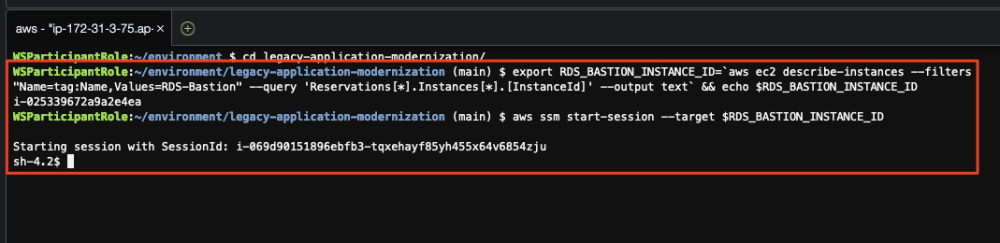
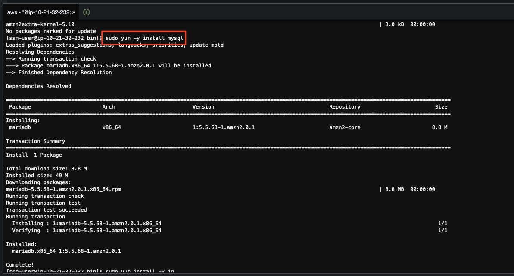

# 모놀리스 데이터베이스 설정

우선 모놀리스 애플리케이션이 사용할 데이터베이스의 스키마를 생성하고 초기데이터를 입력하는 작업을 수행합니다.

모놀리스 애플리케이션은 모놀리스로부터 마이크로서비스로의 전환을 쉽게 이해하기 위해 간단하 구조로 작성되어 있으며, 두 개의 테이블로부터 데이터를 조회하여 화면에 표시하는 전통적인 톰캣 기반의 J2EE 애플리케이션입니다. 

---

## 1. `MySQL` 데이터베이스 설정

1. `데이터베이스 배스천 호스트` 인스턴스에 접속
현재 작업하고 있는 `Cloud9` 인스턴스는 데이터베이스가 위치한 네트워크에 직접 접근할 수 없습니다.

우선 아래와 같이 데이터베이스 네트워크에 위치한 `RDS (Relational Database Service) 배스천 호스트`에 접속합니다.

```bash
export RDS_BASTION_INSTANCE_ID=`aws ec2 describe-instances --filters "Name=tag:Name,Values=RDS-Bastion" --query 'Reservations[*].Instances[*].[InstanceId]' --output text` && echo $RDS_BASTION_INSTANCE_ID
aws ssm start-session --target $RDS_BASTION_INSTANCE_ID
```



2. `MySQL` 데이터베이스 접속을 위한 클라이언트 설치
`MySQL` 클라이언트를 설치합니다.

```bash
bash
sudo yum update -y
sudo yum -y install mysql
sudo yum install -y jq
```



3. `MySQL` 데이터베이스 접속
다음을 수행하여 `MySQL` 데이터베이스에 접속합니다.

> 📌 (참고) <br>
> `MySQL` 데이터베이스의 사용자 이름 및 비밀번호는 테라폼을 통해 자원이 생성될 때 자동으로 설정되며, `AWS Secrets Manager`에 저장되어 있습니다.<br>
> 아래 명령은 `AWS Secrets Manager`에서 데이터베이스 접속 정보를 가져와서 `MySQL` 데이터베이스에 접속합니다.

```bash
export AWS_ACCOUNT_ID=$(aws sts get-caller-identity --query Account --output=text) && echo $AWS_ACCOUNT_ID
export AWS_DEFAULT_REGION=ap-northeast-2
export DATABASE_SECRETS="mysql_master_password"
export DATABASE_CREDENTIALS=$(aws secretsmanager get-secret-value --secret-id $DATABASE_SECRETS --query SecretString --output text) && echo $DATABASE_CREDENTIALS
export DATABASE_USERNAME=$(echo $DATABASE_CREDENTIALS | jq -r '.username') && echo $DATABASE_USERNAME
export DATABASE_PASSWORD=$(echo $DATABASE_CREDENTIALS | jq -r '.password') && echo $DATABASE_PASSWORD
mysql -u ${DATABASE_USERNAME} --password="${DATABASE_PASSWORD}" -h `aws rds describe-db-clusters --db-cluster-identifier m2m-general-aurora-mysql --query "DBClusters[0].Endpoint" --output text`
```
