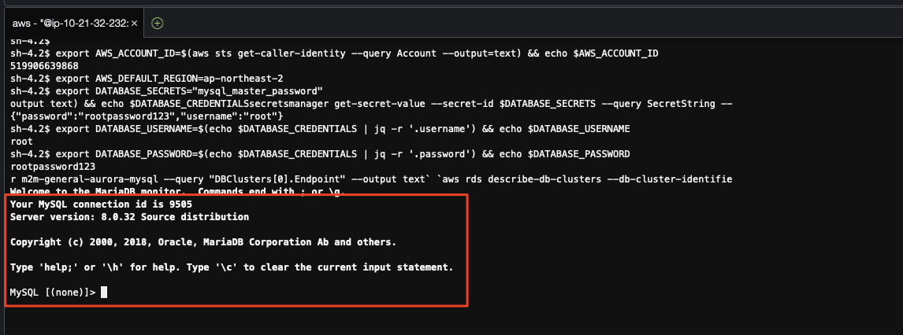
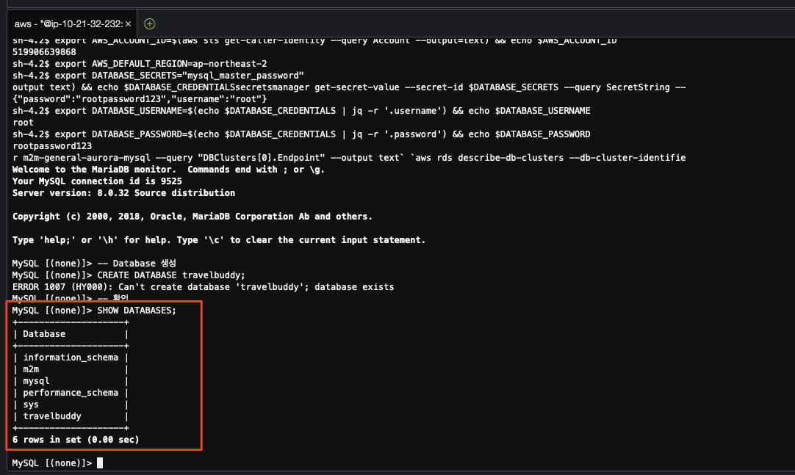
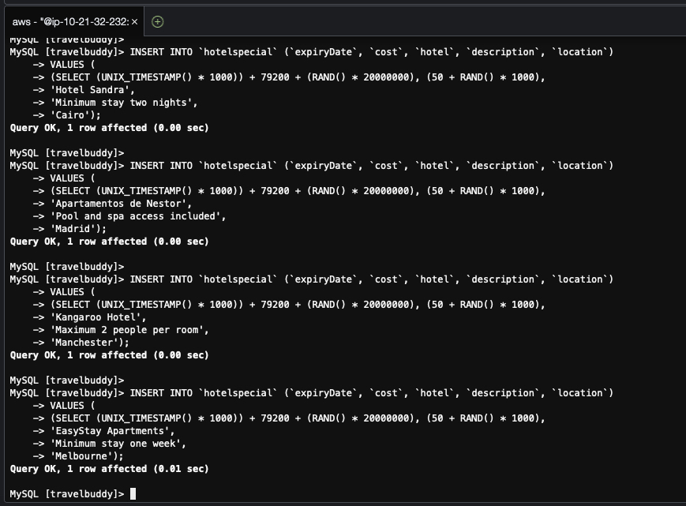

# 모놀리스 데이터베이스 설정

우선 모놀리스 애플리케이션이 사용할 데이터베이스의 스키마를 생성하고 초기데이터를 입력하는 작업을 수행합니다.

모놀리스 애플리케이션은 모놀리스로부터 마이크로서비스로의 전환을 쉽게 이해하기 위해 간단하 구조로 작성되어 있으며, 두 개의 테이블로부터 데이터를 조회하여 화면에 표시하는 전통적인 톰캣 기반의 J2EE 애플리케이션입니다. 

---

## 1. 모놀리스 데이터베이스 접속

1. `데이터베이스 배스천 호스트` 인스턴스에 접속
현재 작업하고 있는 `Cloud9` 인스턴스는 데이터베이스가 위치한 네트워크에 직접 접근할 수 없습니다.

우선 아래와 같이 데이터베이스 네트워크에 위치한 `RDS (Relational Database Service) 배스천 호스트`에 접속합니다.

```bash
export RDS_BASTION_INSTANCE_ID=`aws ec2 describe-instances --filters "Name=tag:Name,Values=RDS-Bastion" --query 'Reservations[*].Instances[*].[InstanceId]' --output text` && echo $RDS_BASTION_INSTANCE_ID
aws ssm start-session --target $RDS_BASTION_INSTANCE_ID
```


2. `MySQL` 데이터베이스 접속을 위한 클라이언트 설치
`MySQL` 클라이언트를 설치합니다.

```bash
bash
sudo yum update -y
sudo yum -y install mysql
sudo yum install -y jq
```


3. `MySQL` 데이터베이스 접속
다음을 수행하여 `MySQL` 데이터베이스에 접속합니다.

> 📌 (참고) <br>
> `MySQL` 데이터베이스의 사용자 이름 및 비밀번호는 테라폼을 통해 자원이 생성될 때 자동으로 설정되며, `AWS Secrets Manager`에 저장되어 있습니다.<br>
> 아래 명령은 `AWS Secrets Manager`에서 데이터베이스 접속 정보를 가져와서 `MySQL` 데이터베이스에 접속합니다.

```bash
export AWS_ACCOUNT_ID=$(aws sts get-caller-identity --query Account --output=text) && echo $AWS_ACCOUNT_ID
export AWS_DEFAULT_REGION=ap-northeast-2
export DATABASE_SECRETS="mysql_master_password"
export DATABASE_CREDENTIALS=$(aws secretsmanager get-secret-value --secret-id $DATABASE_SECRETS --query SecretString --output text) && echo $DATABASE_CREDENTIALS
export DATABASE_USERNAME=$(echo $DATABASE_CREDENTIALS | jq -r '.username') && echo $DATABASE_USERNAME
export DATABASE_PASSWORD=$(echo $DATABASE_CREDENTIALS | jq -r '.password') && echo $DATABASE_PASSWORD
mysql -u ${DATABASE_USERNAME} --password="${DATABASE_PASSWORD}" -h `aws rds describe-db-clusters --db-cluster-identifier m2m-general-aurora-mysql --query "DBClusters[0].Endpoint" --output text`
```



---

## 2. 모놀리스 데이터베이스 설정

1. `MySQL` 데이터베이스 생성

모놀리스 애플리케이션은 `travelbuddy` 데이터베이스를 사용합니다. 아래와 같이 데이터베이스를 생성합니다.

```sql
-- Database 생성
CREATE DATABASE travelbuddy;
-- 확인
SHOW DATABASES;
```



2. `MySQL` 데이터베이스 스키마 생성 및 초기 데이터 입력

모놀리스 애플리케이션은 간단한 두 개의 업무 로직으로 구성되어 있으므로, 각각의 테이블을 생성하고 초기 데이터를 입력합니다.

```sql
USE travelbuddy;

DROP TABLE IF EXISTS `flightspecial`;
CREATE TABLE `flightspecial` (`id` int(11) unsigned NOT NULL AUTO_INCREMENT,
`header` varchar(255) NOT NULL DEFAULT '',
`body` varchar(255) DEFAULT NULL,
`origin` varchar(255) DEFAULT NULL,
`originCode` varchar(6) DEFAULT NULL,
`destination` varchar(255) DEFAULT NULL,
`destinationCode` varchar(6) DEFAULT NULL,
`cost` int(11) NOT NULL,
`expiryDate` bigint(16) NOT NULL,
PRIMARY KEY (`id`)) ENGINE=InnoDB AUTO_INCREMENT=1 DEFAULT
CHARSET=utf8;

INSERT INTO `flightspecial` (`expiryDate`, `cost`, `header`, `body`, `origin`, `originCode`, `destination`, `destinationCode`)
VALUES (
(SELECT (UNIX_TIMESTAMP() * 1000)) + 79200 + (RAND() * 20000000), (50 + RAND() * 200),
'London to Prague',
'Jewel of the East',
'London',
'LHR',
'Paris',
'CDG');

INSERT INTO `flightspecial` (`expiryDate`, `cost`, `header`, `body`, `origin`, `originCode`, `destination`, `destinationCode`)
VALUES (
(SELECT (UNIX_TIMESTAMP() * 1000)) + 79200 + (RAND() * 20000000), (50 + RAND() * 200),
'Paris to London',
'Weekend getaway!',
'Origin',
'ORG',
'Destination',
'DST');

INSERT INTO `flightspecial` (`expiryDate`, `cost`, `header`, `body`, `origin`, `originCode`, `destination`, `destinationCode`)
VALUES (
(SELECT (UNIX_TIMESTAMP() * 1000)) + 79200 + (RAND() * 20000000), (50 + RAND() * 200),
'Dubai to Cairo',
'Middle East adventure',
'Origin',
'ORG',
'Destination',
'DST');

INSERT INTO `flightspecial` (`expiryDate`, `cost`, `header`, `body`, `origin`, `originCode`, `destination`, `destinationCode`)
VALUES (
(SELECT (UNIX_TIMESTAMP() * 1000)) + 79200 + (RAND() * 20000000), (50 + RAND() * 500),
'Melbourne to Hawaii',
'Escape to the sun this winter',
'Origin',
'ORG',
'Destination',
'DST');

INSERT INTO `flightspecial` (`expiryDate`, `cost`, `header`, `body`, `origin`, `originCode`, `destination`, `destinationCode`)
VALUES (
(SELECT (UNIX_TIMESTAMP() * 1000)) + 79200 + (RAND() * 20000000), (50 + RAND() * 200),
'Buenos Aires to Rio',
'Time to carnivale!',
'Origin',
'ORG',
'Destination',
'DST');

INSERT INTO `flightspecial` (`expiryDate`, `cost`, `header`, `body`, `origin`, `originCode`, `destination`, `destinationCode`)
VALUES (
(SELECT (UNIX_TIMESTAMP() * 1000)) + 79200 + (RAND() * 20000000), (50 + RAND() * 500),
'Sydney to Rome',
'An Italian classic',
'Origin',
'ORG',
'Destination',
'DST');

INSERT INTO `flightspecial` (`expiryDate`, `cost`, `header`, `body`, `origin`, `originCode`, `destination`, `destinationCode`)
VALUES (
(SELECT (UNIX_TIMESTAMP() * 1000)) + 79200 + (RAND() * 20000000), (50 + RAND() * 500),
'Melbourne to Sydney',
'Well trodden path',
'Origin',
'ORG',
'Destination',
'DST');

INSERT INTO `flightspecial` (`expiryDate`, `cost`, `header`, `body`, `origin`, `originCode`, `destination`, `destinationCode`)
VALUES (
(SELECT (UNIX_TIMESTAMP() * 1000)) + 79200 + (RAND() * 20000000), (50 + RAND() * 500),
'Hong Kong to Kuala Lumpur',
'Hop step and a jump',
'Origin',
'ORG',
'Destination',
'DST');

INSERT INTO `flightspecial` (`expiryDate`, `cost`, `header`, `body`, `origin`, `originCode`, `destination`, `destinationCode`)
VALUES (
(SELECT (UNIX_TIMESTAMP() * 1000)) + 79200 + (RAND() * 20000000), (50 + RAND() * 500),
'Lisbon to Madrid',
'Spanish adventure',
'Origin',
'ORG',
'Destination',
'DST');

INSERT INTO `flightspecial` (`expiryDate`, `cost`, `header`, `body`, `origin`, `originCode`, `destination`, `destinationCode`)
VALUES (
(SELECT (UNIX_TIMESTAMP() * 1000)) + 79200 + (RAND() * 20000000), (50 + RAND() * 500),
'Aswan to Cairo',
'An experience of a lifetime',
'Origin',
'ORG',
'Destination',
'DST');

INSERT INTO `flightspecial` (`expiryDate`, `cost`, `header`, `body`, `origin`, `originCode`, `destination`, `destinationCode`)
VALUES (
(SELECT (UNIX_TIMESTAMP() * 1000)) + 79200 + (RAND() * 20000000), (50 + RAND() * 500),
'New York to London',
'Trans-Atlantic',
'Origin',
'ORG',
'Destination',
'DST');

#--------------------------------------------------------------------------------------------------------------------- #--------------------------------------------------------------------------------------------------------------------- #--------------------------------------------------------------------------------------------------------------------- #--------------------------------------------------------------------------------------------------------------------- #---------------------------------------------------------------------------------------------------------------------
DROP TABLE IF EXISTS `hotelspecial`;
CREATE TABLE `hotelspecial` (
    `id` int(11) unsigned NOT NULL AUTO_INCREMENT,
    `hotel` varchar(255) NOT NULL DEFAULT '',
    `description` varchar(255) DEFAULT NULL,
    `location` varchar(255) DEFAULT NULL,
    `cost` int(11) NOT NULL,
    `expiryDate` bigint(16) NOT NULL,
    PRIMARY KEY (`id`)
) ENGINE=InnoDB AUTO_INCREMENT=1 DEFAULT
CHARSET=utf8;

INSERT INTO `hotelspecial` (`expiryDate`, `cost`, `hotel`, `description`, `location`)
VALUES (
(SELECT (UNIX_TIMESTAMP() * 1000)) + 79200 + (RAND() * 20000000), (50 + RAND() * 1000),
'Sommerset Hotel',
'Minimum stay 3 nights',
'Sydney');

INSERT INTO `hotelspecial` (`expiryDate`, `cost`, `hotel`, `description`, `location`)
VALUES (
(SELECT (UNIX_TIMESTAMP() * 1000)) + 79200 + (RAND() * 20000000), (50 + RAND() * 1000),
'Freedmom Apartments',
'Pets allowed!',
'Sydney');

INSERT INTO `hotelspecial` (`expiryDate`, `cost`, `hotel`, `description`, `location`)
VALUES (
(SELECT (UNIX_TIMESTAMP() * 1000)) + 79200 + (RAND() * 20000000), (50 + RAND() * 1000),
'Studio City',
'Minimum stay one week',
'Los Angeles');

INSERT INTO `hotelspecial` (`expiryDate`, `cost`, `hotel`, `description`, `location`)
VALUES (
(SELECT (UNIX_TIMESTAMP() * 1000)) + 79200 + (RAND() * 20000000), (50 + RAND() * 1000),
'Le Fleur Hotel',
'Not available weekends',
'Los Angeles');

INSERT INTO `hotelspecial` (`expiryDate`, `cost`, `hotel`, `description`, `location`)
VALUES (
(SELECT (UNIX_TIMESTAMP() * 1000)) + 79200 + (RAND() * 20000000), (50 + RAND() * 1000),
'Classic Hotel',
'Includes breakfast',
'Dallas');

INSERT INTO `hotelspecial` (`expiryDate`, `cost`, `hotel`, `description`, `location`)
VALUES (
(SELECT (UNIX_TIMESTAMP() * 1000)) + 79200 + (RAND() * 20000000), (50 + RAND() * 1000),
'Groundhog Suites',
'Internet access included',
'Florida');

INSERT INTO `hotelspecial` (`expiryDate`, `cost`, `hotel`, `description`, `location`)
VALUES (
(SELECT (UNIX_TIMESTAMP() * 1000)) + 79200 + (RAND() * 20000000), (50 + RAND() * 1000),
'Sophmore Suites',
'Maximum 2 people per room',
'London');

INSERT INTO `hotelspecial` (`expiryDate`, `cost`, `hotel`, `description`, `location`)
VALUES (
(SELECT (UNIX_TIMESTAMP() * 1000)) + 79200 + (RAND() * 20000000), (50 + RAND() * 1000),
'Hotel Sandra',
'Minimum stay two nights',
'Cairo');

INSERT INTO `hotelspecial` (`expiryDate`, `cost`, `hotel`, `description`, `location`)
VALUES (
(SELECT (UNIX_TIMESTAMP() * 1000)) + 79200 + (RAND() * 20000000), (50 + RAND() * 1000),
'Apartamentos de Nestor',
'Pool and spa access included',
'Madrid');

INSERT INTO `hotelspecial` (`expiryDate`, `cost`, `hotel`, `description`, `location`)
VALUES (
(SELECT (UNIX_TIMESTAMP() * 1000)) + 79200 + (RAND() * 20000000), (50 + RAND() * 1000),
'Kangaroo Hotel',
'Maximum 2 people per room',
'Manchester');

INSERT INTO `hotelspecial` (`expiryDate`, `cost`, `hotel`, `description`, `location`)
VALUES (
(SELECT (UNIX_TIMESTAMP() * 1000)) + 79200 + (RAND() * 20000000), (50 + RAND() * 1000),
'EasyStay Apartments',
'Minimum stay one week',
'Melbourne');
```



3. `MySQL` 데이터베이스 및 `RDS 배스쳔` 세션 종료
```bash
quit;

# Bash 쉘 종료
exit

# 쉘 (sh) 종료
exit
```

---

# 모놀리스 애플리케이션이 사용할 데이터베이스를 성공적으로 구성하였습니다.

다음 단계로 진행합니다.
