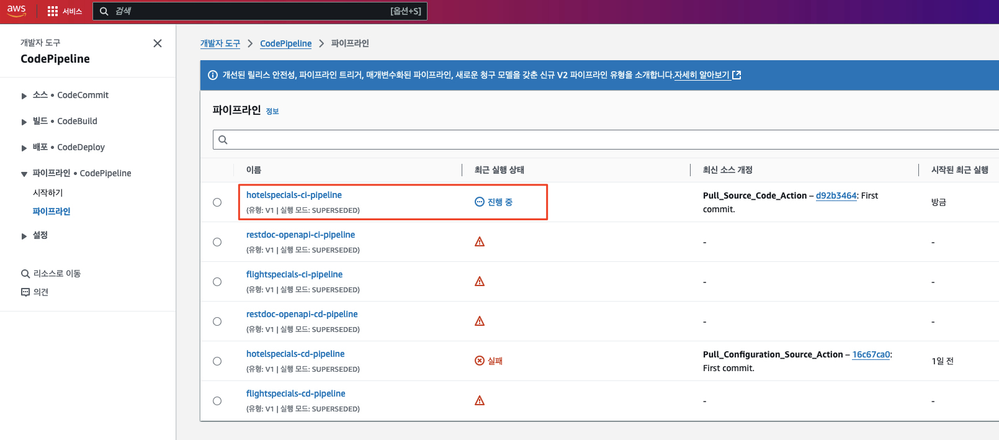
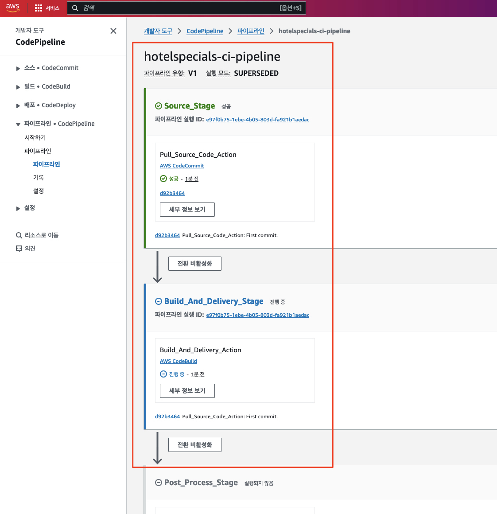
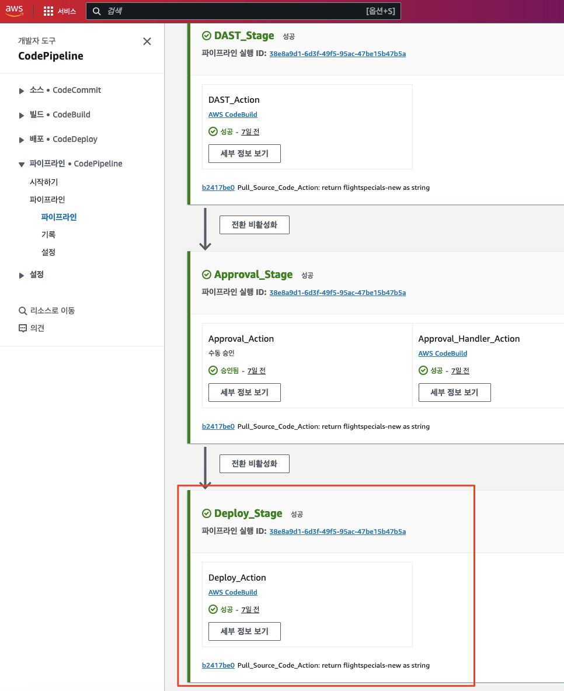
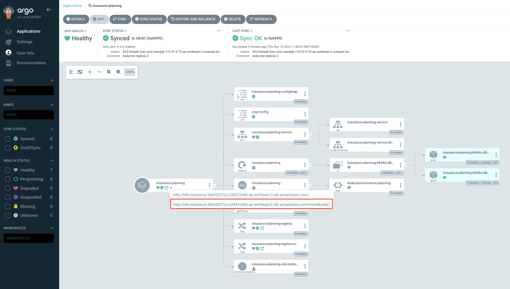
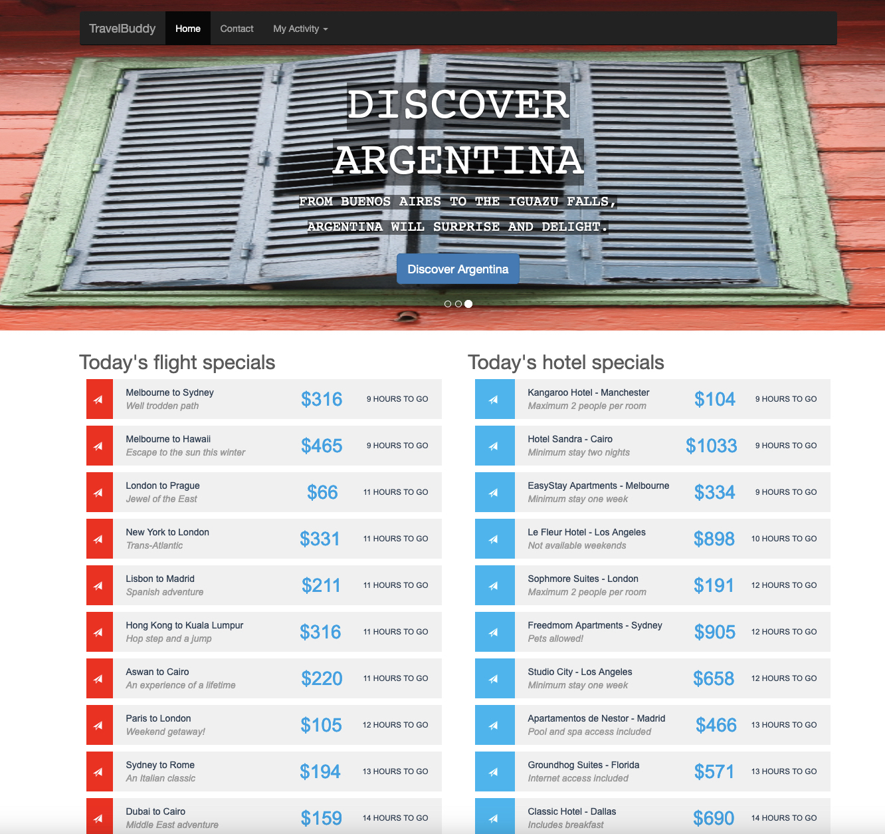
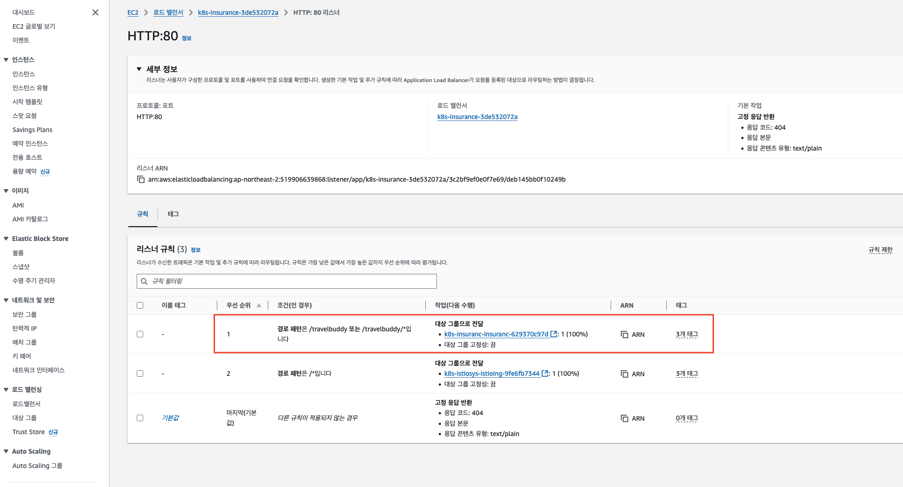

# 모놀리스 애플리케이션 빌드 및 배포

이제 모놀리스 애플리케이션을 빌드하고 배포해 보도록 하겠습니다.

> 📕 (참고) <br>
> 테라폼을 통해서 자원을 생성하는 과정에서 이를 위한 파이프라인도 함께 생성되었으며, 이번 실습에서는 `AWS CodePipelien`이라고 하는 서비스를 사용합니다.<br>
> 이러한 과정은 다른 DevOps 혹은 CI/CD 서비스에서도 유사하게 구성 가능하며 `Microsoft Azure DevOps` 환경에서는 아래와 같은 문서를 참조할 수 있습니다. <br>
> - [[Azure에서 Terraform 프로젝트에 대한 통합 테스트 구성]](https://learn.microsoft.com/ko-kr/azure/developer/terraform/best-practices-integration-testing)

> 📕 (참고)<br>
> 앞서 배포를 위한 `ArgoCD` 애플리케이션 설정 시 자동 배포를 비활성화 해 두었습니다.<br>
> 이와 같이 일반적으로 실제 운영 환경에서는 자동 배포를 활성화하지 않는 것이 좋습니다. 이는 배포의 안정성을 위함입니다.<br>
> 하지만 오늘 워크샵은 테스트나 검증 환경에서 자동으로 배포하는 시나리오이며 빌드 파이프라인의 마지막 단계에서 자동으로 배포가 이루어지도록 설정되어 있습니다 (`ArgoCD` CLI 사용).

---

## 1. 모놀리스 애플리케이션 빌드 및 배포

1. 모놀리스 애플리케이션 빌드 파이프라인 트리거

아래 명령을 실행하여 모놀리스 애플리케이션 빌드 파이프라인을 트리거합니다. 이 명령은 빌드 파이프라인의 소스 리포지터리에 소스 코드를 푸시하여 빌드 파이프라인을 트리거하는 것입니다.

```bash
# 어플리케이션 소스 경로로 이동
cd ~/environment/legacy-application-modernization/legacy/applications/TravelBuddy/build/

# 로컬 Git 설정
git init
git branch -M main

# 리모트 Git 리포지터리 주소 획득
export BUILD_CODECOMMIT_URL=$(aws codecommit get-repository --repository-name hotelspecials-application --region ap-northeast-2 | grep -o '"cloneUrlHttp": "[^"]*'|grep -o '[^"]*$')
echo $BUILD_CODECOMMIT_URL

# 리모트 Git 리포지터리 연결
git remote add origin $BUILD_CODECOMMIT_URL

# Git 스테이징 영역에 파일을 추가
git add .

# Commit 및 Push
git commit -am "First commit."
git push --set-upstream origin main
```

2. 모놀리스 애플리케이션 빌드 파이프라인 상태 확인

진행자의 안내에 따라 `AWS 콘솔` > `AWS CodePipeline` 콘솔로 이동하여 모놀리스 애플리케이션 빌드 파이프라인의 상태를 확인하고 종료될 때까지 잠시 기다립니다.





> 📌 (참고)<br>
> 빌드 파이프라인이 수행되는 도중에 문제가 발생하면 진행자의 안내를 받아 조치해 봅니다.<br>
> 많은 경우 각 단계의 로그를 확인하고 문제를 해결할 수 있습니다.

파이프라인이 성공적으로 수행되면 아래와 같이 표시됩니다.



---

## 2. 모놀리스 애플리케이션 접속

1. 모놀리스 애플리케이션 접속

`ArgoCD`의 모놀리스 애플리케이션 상태도 정상적으로 배포된 것을 확인할 수 있습니다.



위 그림에서와 같이 `Ingress` 중 `/travelbuddy/` 경로가 포함된 URL을 클릭하면 모놀리스 애플리케이션에 접속할 수 있습니다.



---

## 3. (Optional) 모놀리스 애플리케이션의 접속 경로 (`Application Load Balancer`) 확인

우리가 배포한 모놀리스 애플리케이션에 접속하는 관문인 `Application Load Balancer`와 경로 규칙을 진행자와 함께 둘러보면서 다음 단계와 어떻게 연관되는지 살펴봅니다.



---

# 🎊🎊🎊 축하합니다! 모놀리스 애플리케이션 빌드 및 배포를 완료하였습니다.🎊🎊

> 📕 (참고)<br>
> 현재 접속한 애플리케이션은 비록 단순하지만 두 개의 데이터베이스 테이블을 조회하는 기능을 제공합니다.<br>
> 우리는 이 애플리케이션을 레거시 업무 로직, 예를 들어 보험 가입 설계를 위한 업무를 처리하는 모놀리스로 가정하고 있습니다.<br>
> 그리고 다음 단계에서는 그 기능 중 하나인 가입 고객을 위한 항공권 선물 기능을 (`FlightSpecials`) 마이크로서비스로 분리하면서 점진적으로 분리하는 여정의 시작을 살펴 보도록 합니다.

> 📕 (참고)<br>
> `ArogoCD`로 배포된 `Ingress` 중에서 `/` (루트) 경로는 아직 작동하지 않습니다.<br>
> 이 경로는 `FlightSpecials` 마이크로서비스가 정상적으로 분리되고 루트 경로를 처리하는 (`URL Rewrite`) `Istio` 게이트웨이가 배포되면 정상적으로 작동하게 됩니다.
