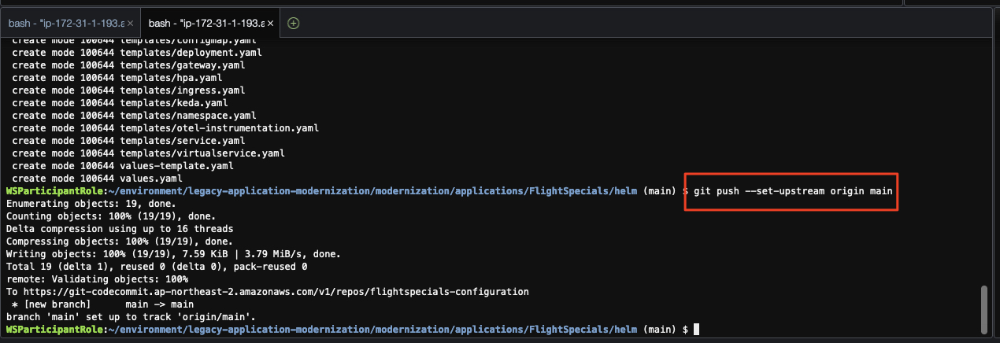
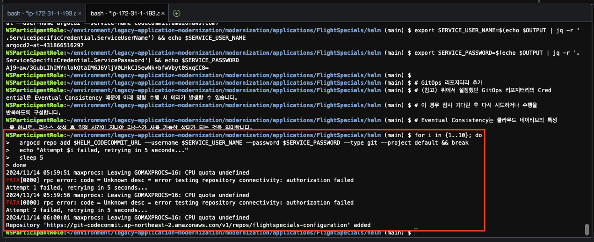
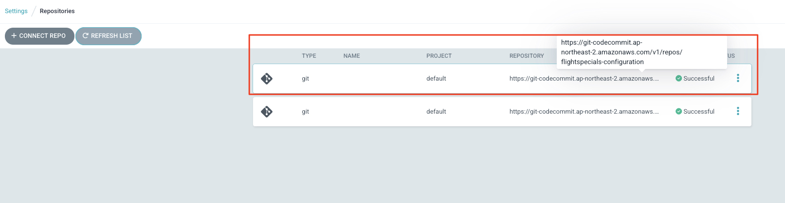
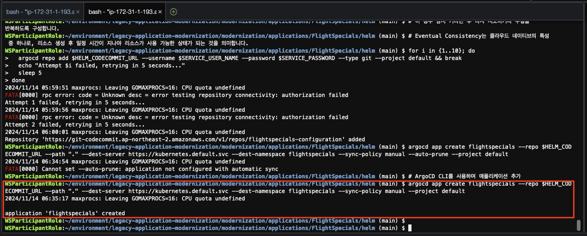
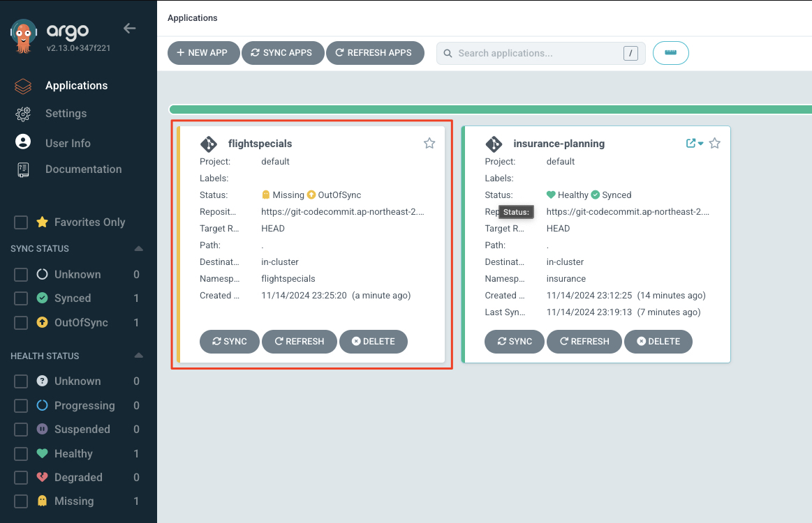

# ***마이크로서비스를 위한 `GitOps` 설정***

잠재 고객을 위한 위해 준비된 마이크로서비스 (`FlightSpecials` 서비스)를 분리해 보겠습니다.

이 마이크로서비스도 `GitOps`를 통해 배포되므로 `GitOps` 형상을 위한 리포지터리를 설정해 보도록 하겠습니다.

---

## 1. 마이크로서비스의 `GitOps` 리포지터리 초기화


```bash
# 어플리케이션 Helm Artifact 경로로 이동
cd ~/environment/legacy-application-modernization/modernization/applications/FlightSpecials/helm

# Git 연결
git init
git branch -M main

# GitOps 리포지터리 URL 확인
export HELM_CODECOMMIT_URL=$(aws codecommit get-repository --repository-name flightspecials-configuration --region ap-northeast-2 | grep -o '"cloneUrlHttp": "[^"]*' | grep -o '[^"]*$')
echo $HELM_CODECOMMIT_URL

# GitOps 배포 리포지터리와 연결
git remote add origin $HELM_CODECOMMIT_URL

# Git 스테이징 영역에 파일을 추가
git add .

# GitOps 리포지터리에 Push
git commit -am "First commit."
git push --set-upstream origin main
```



---

## 2. `ArgoCD` `GitOps` 리포지터리 생성

이전 모놀리스에서 수행했던 것과 유사하게 아래와 같이 `ArgoCD`에 `GitOps` 리포지터리를 설정합니다.

이번에는 `ArgoCD`의 웹 UI를 통하지 않고 `ArgoCD CLI`를 통해 설정해 보겠습니다.

```bash
export ARGOCD_ADMIN_PASSWORD_SECRET_ID=flightspecials-ci-argocd-admin-password

# GitOps 리포지터리 URL 확인
export HELM_CODECOMMIT_URL=$(aws codecommit get-repository --repository-name flightspecials-configuration --region ap-northeast-2 | grep -o '"cloneUrlHttp": "[^"]*' | grep -o '[^"]*$')
echo $HELM_CODECOMMIT_URL

# ArgoCD Server URL
export ARGOCD_SERVER=`kubectl get ingress/argocd-server -n argocd -o json | jq --raw-output '.status.loadBalancer.ingress[0].hostname'`
echo "ARGOCD_SERVER: ${ARGOCD_SERVER}"

# AWS Secrets Manager로 부터 ArgoCD admin 암호 조회
export ARGOCD_ADMIN_PASSWORD=`aws secretsmanager get-secret-value --secret-id $ARGOCD_ADMIN_PASSWORD_SECRET_ID --query SecretString --output text`

# ArgoCD 서버에 로그인
argocd login ${ARGOCD_SERVER} --username admin --password ${ARGOCD_ADMIN_PASSWORD} --insecure --grpc-web

# IAM User 생성 - 이 과정은 이전에 한번 수행하여 꼭 필요하지는 않지만 스크립트 완전성을 위해 추가
aws iam create-user --user-name argocd2
aws iam attach-user-policy --user-name argocd2 --policy-arn arn:aws:iam::aws:policy/AWSCodeCommitPowerUser
OUTPUT=$(aws iam create-service-specific-credential --user-name argocd2 --service-name codecommit.amazonaws.com)
export SERVICE_USER_NAME=$(echo $OUTPUT | jq -r '.ServiceSpecificCredential.ServiceUserName') && echo $SERVICE_USER_NAME
export SERVICE_PASSWORD=$(echo $OUTPUT | jq -r '.ServiceSpecificCredential.ServicePassword') && echo $SERVICE_PASSWORD

# GitOps 리포지터리 추가
# (참고) 위에서 설정했던 GitOps 리포지터리의 Credential은 Eventual Consistency 때문에 아래 명령 수행 시 에러가 발생할 수 있습니다.
# 이 경우 잠시 기다린 후 다시 시도하거나 수행을 반복하도록 구성합니다.
# Eventual Consistency는 클라우드 네이티브의 특성 중 하나로, 리소스 생성 후 일정 시간이 지나야 리소스가 사용 가능한 상태가 되는 것을 의미합니다. 
for i in {1..10}; do
  argocd repo add $HELM_CODECOMMIT_URL --username $SERVICE_USER_NAME --password $SERVICE_PASSWORD --type git --project default && break
  echo "Attempt $i failed, retrying in 5 seconds..."
  sleep 5
done
```





---

## 3. `ArgoCD` 애플리케이션 생성 (마이크로서비스)

이제 `ArgoCD`에 마이크로서비스 애플리케이션을 추가해 보겠습니다.

동일하게 `ArgoCD CLI`를 사용합니다.

```bash
# ArgoCD CLI를 사용하여 애플리케이션 추가
argocd app create flightspecials --repo $HELM_CODECOMMIT_URL --path "." --dest-server https://kubernetes.default.svc --dest-namespace flightspecials --sync-policy manual --project default
```





> 📒️ (참고)<br>
> `ArgoCD`에서 애플리케이션이 생성되면 아직 동기화가 되지 않았으므로 `OutOfSync`로 표시됩니다.<br>
> 이후 설정할 빌드 파이프라인이 잘 수행되면 `ArgoCD`에서 애플리케이션 배포가 자동으로 수행되고 `Synced`로 표시됩니다.

--- 

> 🎊 마이크로서비스 애플리케이션을 배포하는 `ArgoCD` 설정을 완료하였습니다. 이제 애플리케이션의 빌드 파이프라인을 설정하고 빌드를 진행한 후 최종적으로 `ArgoCD`를 통해 배포를 수행해 보겠습니다.
