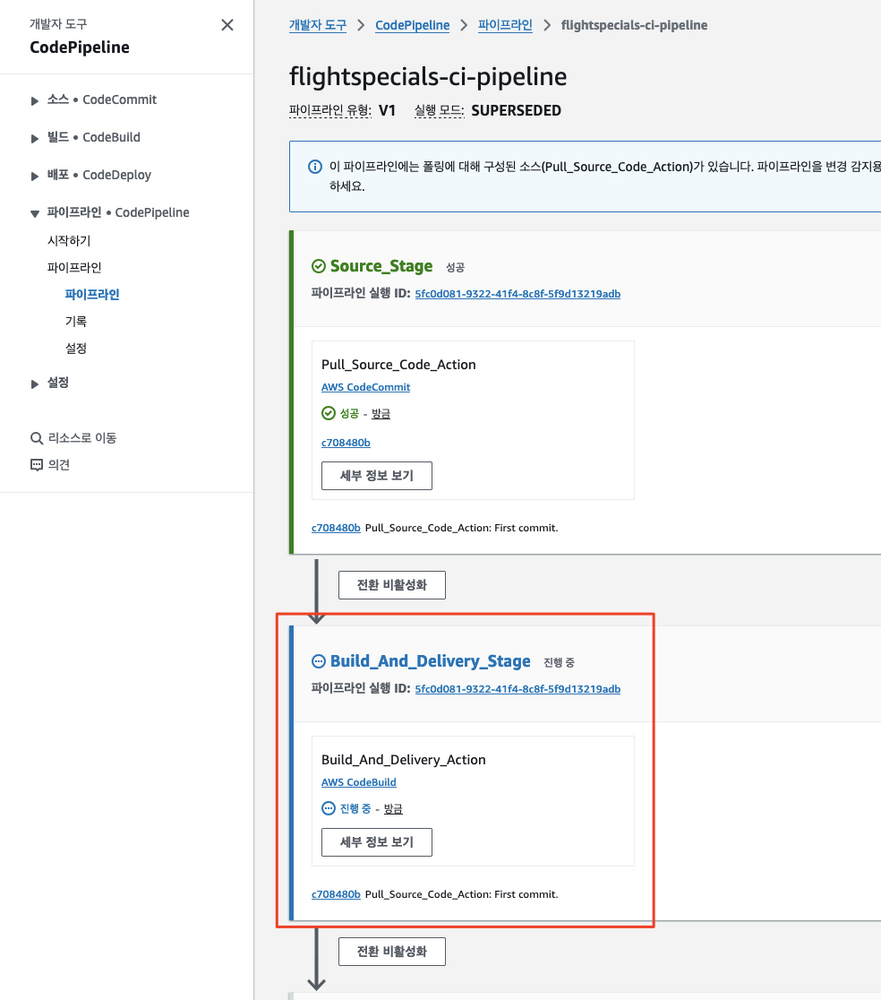
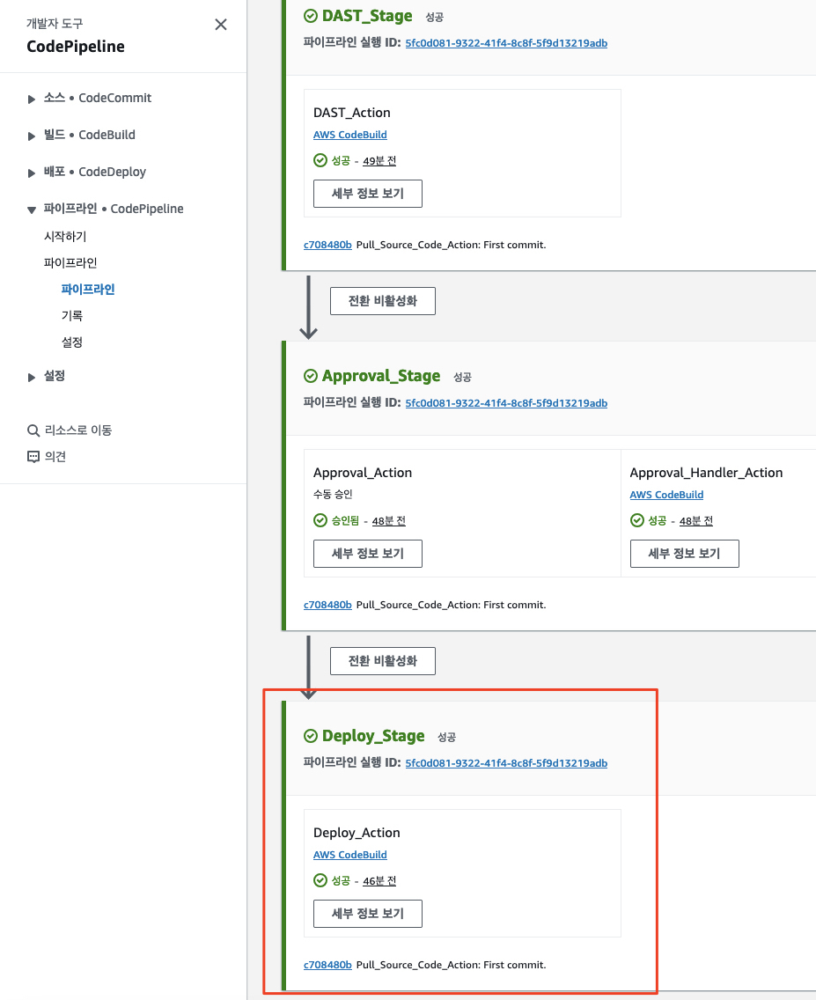
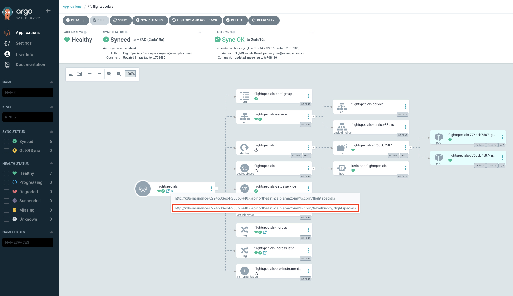
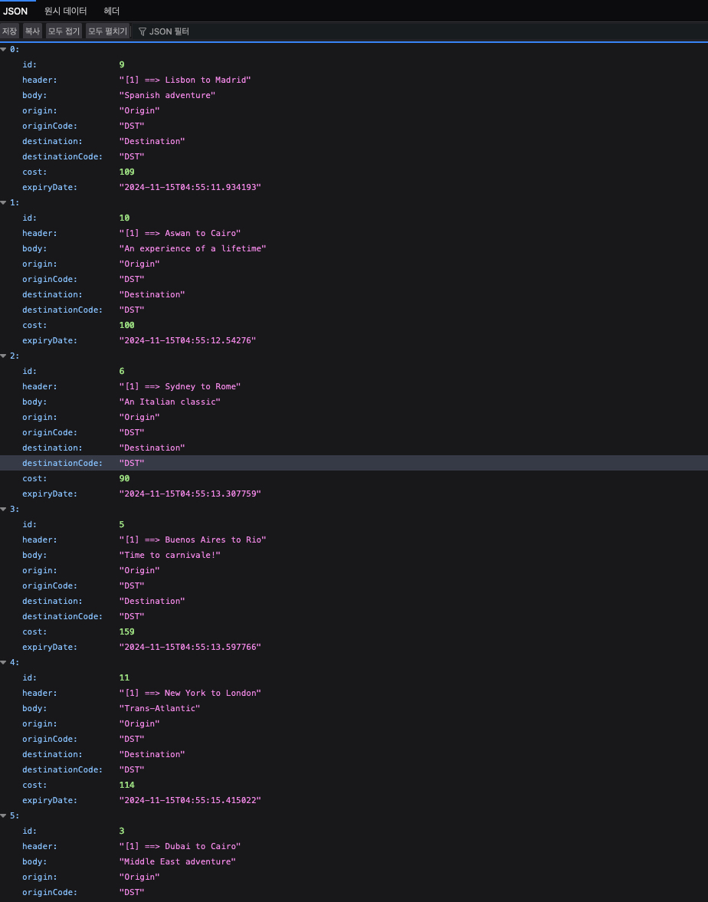
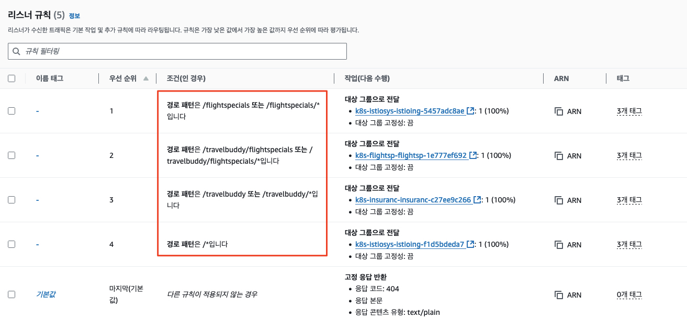
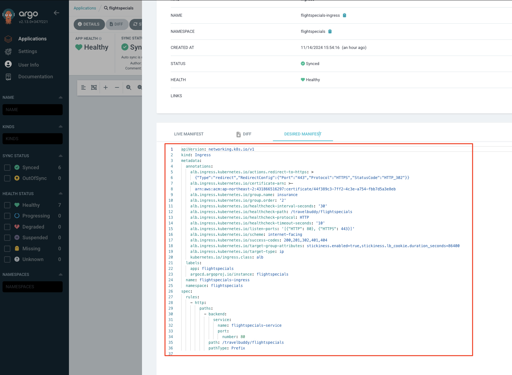
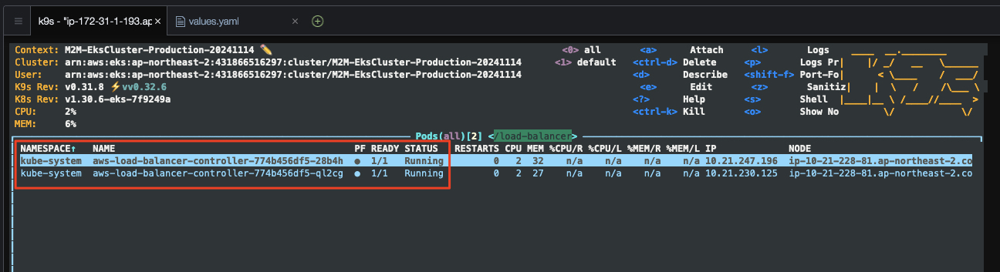

# 마이크로서비스 애플리케이션 빌드 및 배포

이제 마이크로서비스 애플리케이션을 빌드하고 배포해 보도록 하겠습니다.

---

## 1. 마이크로서비스 애플리케이션 빌드 파이프라인 트리거

1. 마이크로서비스 애플리케이션 빌드 파이프라인 트리거

아래 명령을 실행하여 마이크로서비스 애플리케이션 빌드 파이프라인을 트리거합니다. 이 명령은 빌드 파이프라인의 소스 리포지터리에 소스 코드를 푸시하여 빌드 파이프라인을 트리거하는 것입니다.

```bash
# 어플리케이션 소스 경로로 이동
cd ~/environment/legacy-application-modernization/modernization/applications/FlightSpecials/build/

# Git 연결
git init
git branch -M main

# 리모트 Git 리포지터리 주소 획득
export BUILD_CODECOMMIT_URL=$(aws codecommit get-repository --repository-name flightspecials-application --region ap-northeast-2 | grep -o '"cloneUrlHttp": "[^"]*'|grep -o '[^"]*$')
echo $BUILD_CODECOMMIT_URL

# 리모트 Git 리포지터리 연결
git remote add origin $BUILD_CODECOMMIT_URL

# Git 스테이징 영역에 파일을 추가
git add .

# Commit 및 Push
git commit -am "First commit."
git push --set-upstream origin main
```

2. 마이크로서비스 애플리케이션 빌드 파이프라인 상태 확인

`AWS 콘솔` > `AWS CodePipeline` 콘솔로 이동하여 모놀리스 애플리케이션 빌드 파이프라인의 상태를 확인하고 종료될 때까지 잠시 기다립니다.



> 📌 (참고)<br>
> 빌드 파이프라인이 수행되는 도중에 문제가 발생하면 진행자의 안내를 받아 조치해 봅니다.<br>
> 많은 경우 각 단계의 로그를 확인하고 문제를 해결할 수 있습니다.

파이프라인이 성공적으로 수행되면 아래와 같이 표시됩니다.



---

## 2. 마이크로서비스 애플리케이션 접속

1. 마이크로서비스 애플리케이션 접속

`ArgoCD`의 모놀리스 애플리케이션 상태가 정상적으로 배포된 것을 확인할 수 있습니다.



`Ingress` 중 `/travelbuddy/flightspecials` 경로로 접속하여 마이크로서비스 애플리케이션을 확인합니다.



> 📌 (참고)<br>
> 모놀리스 애플리케이션과 달리 마이크로서비스 애플리케이션은 `REST API` 형태로 제공되므로 브라우저에서 확인 시 `JSON` 형태로 출력되는 것을 확인할 수 있습니다.<br>
> 표현 계층의 로직과 백엔드 로직을 분리하는 것은 애플리케이션 현대화의 주된 패턴 중 하나입니다.

---

## 3. (중요) 마이크로서비스 애플리케이션의 경로 분리 확인

우리는 위에서 마이크로서비스 애플리케이션의 `REST API`의 URL이 여전히 `/travelbuddy/`로 시작하는 것을 확인했습니다.
이는 모놀리스 애플리케이션의 접속 경로와 동일한데 어떻게 마이크로서비스 애플리케이션으로 요청이 전달되었을까요?

그 비밀은 다음과 같은 요소에 숨어 있습니다.
* `AWS Application Load Balancer`의 `Path-based Routing`
* 1번을 AWS 자원으로 생성하기 정의인 쿠버네테스의 `Ingress` 자원 정의
* 그리고 2번 자원을 감시하면서 사용자 대신 클라우드에 자원을 생성해 주는 `AWS Load Balancer Controller`
  * `TargetGroupBinding` CRD
  * `AWS Application Load Balancer`
  * 리스너, 리스너 규칙, 그리고 타겟 그룹

이렇게 구성함으로써 마이크로서비스를 점진적으로 분리하면서 모놀리스 애플리케이션과 마이크로서비스 애플리케이션을 동시에 운영할 수 있습니다.
    
> 📕 (참고)<br>
> 우리는 현재 AWS에서 워크샵을 수행하지만 다른 클라우드 환경에서도 비슷한 방식으로 `Ingress` 리소스를 생성하고 컨트롤러를 통해 `AWS Application Load Balancer`와 유사한 자원을 생성할 수 있습니다.<br>
> 예를 들어 `Azure`의 경우에는 `Azure Application Gateway Ingress Controller (AGIC)`를 통해 유사한 구성을 할 수 있습니다.<br>
> * 참고 문서:
>   * https://learn.microsoft.com/en-us/azure/traffic-manager/traffic-manager-load-balancing-azure
>   * (추천) https://learn.microsoft.com/ko-kr/azure/application-gateway/ingress-controller-overview
<pre>
Azure에서 AWS EKS의 ALB(Application Load Balancer) Target Group Binding과 직접적으로 동일한 기능은 없지만, 유사한 기능을 제공하는 솔루션이 있습니다. Azure Kubernetes Service (AKS)에서 이와 유사한 기능을 구현하는 방법을 설명드리겠습니다:

1. Azure Application Gateway Ingress Controller (AGIC):
   - AGIC는 AKS 클러스터의 인그레스 리소스를 Azure Application Gateway와 연동합니다.
   - 이는 AWS ALB Ingress Controller와 유사한 역할을 합니다.

2. 작동 방식:
   - AGIC는 Kubernetes 인그레스 리소스를 모니터링하고, 이를 기반으로 Application Gateway 설정을 자동으로 구성합니다.
   - 포드 IP 주소를 Application Gateway의 백엔드 풀에 자동으로 추가/제거합니다.

3. 구성 방법:
   - AKS 클러스터에 AGIC를 설치합니다.
   - Application Gateway를 생성하고 AKS와 연결합니다.
   - Kubernetes 매니페스트에서 인그레스 리소스를 정의합니다.

4. 장점:
   - 자동화된 로드 밸런서 구성
   - SSL 종료 지원
   - URL 기반 라우팅
   - WAF(Web Application Firewall) 통합

5. Azure Load Balancer:
   - AKS는 기본적으로 Azure Load Balancer를 사용합니다.
   - 서비스 타입 LoadBalancer를 사용하여 자동으로 로드 밸런서를 프로비저닝합니다.

6. Custom Resource Definitions (CRDs):
   - AGIC는 CRD를 사용하여 추가적인 구성 옵션을 제공합니다.
   - 이를 통해 더 세밀한 로드 밸런싱 설정이 가능합니다.

7. 네트워크 정책:
   - Azure Network Policies를 사용하여 포드 간 트래픽을 제어할 수 있습니다.

8. 서비스 메시:
   - Azure Service Mesh Interface (SMI) 또는 Istio를 사용하여 더 복잡한 트래픽 라우팅과 로드 밸런싱을 구현할 수 있습니다.

9. Azure Front Door:
   - 글로벌 로드 밸런싱이 필요한 경우 Azure Front Door를 사용할 수 있습니다.

10. 확장성:
    - AGIC는 AKS 클러스터의 확장에 따라 자동으로 Application Gateway 설정을 조정합니다.

11. 모니터링 및 로깅:
    - Azure Monitor와 통합되어 로드 밸런서 성능 및 상태 모니터링이 가능합니다.

12. 제한사항:
    - AGIC는 Application Gateway v2 SKU만 지원합니다.
    - 일부 고급 시나리오에서는 수동 구성이 필요할 수 있습니다.

결론적으로, Azure에서는 AGIC를 통해 AWS EKS ALB의 Target Group Binding과 유사한 기능을 제공합니다. 이를 통해 AKS 클러스터의 로드 밸런싱을 자동화하고 관리할 수 있습니다. 다만, 구체적인 구현 방식과 세부 기능에서는 차이가 있을 수 있으므로, 실제 적용 시 Azure의 문서와 베스트 프랙티스를 참조하는 것이 좋습니다.
</pre>


(Optional) 위 내용을 진행자와 함께 간단하게 둘러봅니다.

1. `AWS Application Load Balancer`의 `Path-based Routing`



2. 1번을 AWS 자원으로 생성하기 정의인 쿠버네테스의 `Ingress` 자원 정의




3. 그리고 2번 자원을 감시하면서 사용자 대신 클라우드에 자원을 생성해 주는 `AWS Load Balancer Controller`
    * `TargetGroupBinding` CRD
    * `AWS Application Load Balancer`
    * 리스너, 리스너 규칙, 그리고 타겟 그룹



> 📌 (참고)<br>
> 우리가 구성한 자원에는 `Istio`의 `Ingress Gateway`로 트래픽을 전달하는 `Ingress` 자원도 포함되어 있습니다.<br>
> 하지만 `Istio`에 대한 내용을 다루는 것은 이 워크샵의 범위를 벗어나므로 생략하도록 하겠습니다.

---

# 🎊🎊🎊 마이크로 애플리케이션 빌드 및 배포를 완료하였습니다.🎊🎊

이제 이 두 서비스 사이의 호출 흐름을 연관지어 (`Correlation`) 트레이싱 (추적)할 수 있는 `Observatility` 도구들을 둘러보도록 하겠습니다.
