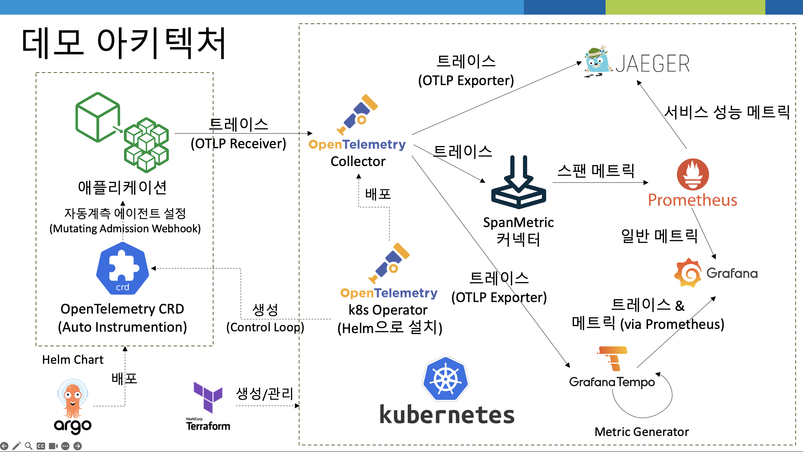

# ***Observability***

우리는 이제 모놀리스 애플리케이션과 이로부터 일부 업무 로직이 분리된 마이크로서비스를 배포했습니다. 이제 이 애플리케이션을 모니터링하고 추적할 수 있는 방법을 알아보겠습니다.

우선 `Jaeger`를 통해 분산 추적을 확인하고, `Grafana`를 통해 모니터링을 수행해 보겠습니다.

> 📕 (참고) 
> `OpenTelemetry`를 통한 `Observability` 도입 소개 문서는 아래 링크에서 받을 수 있습니다. 
> * [[`OpenTelemetry`를 통한 `Observaibility` 도입]](https://legacy-application-modernization.s3.ap-northeast-2.amazonaws.com/Observability-with-OpenTelemetry.pptx) 
> 
