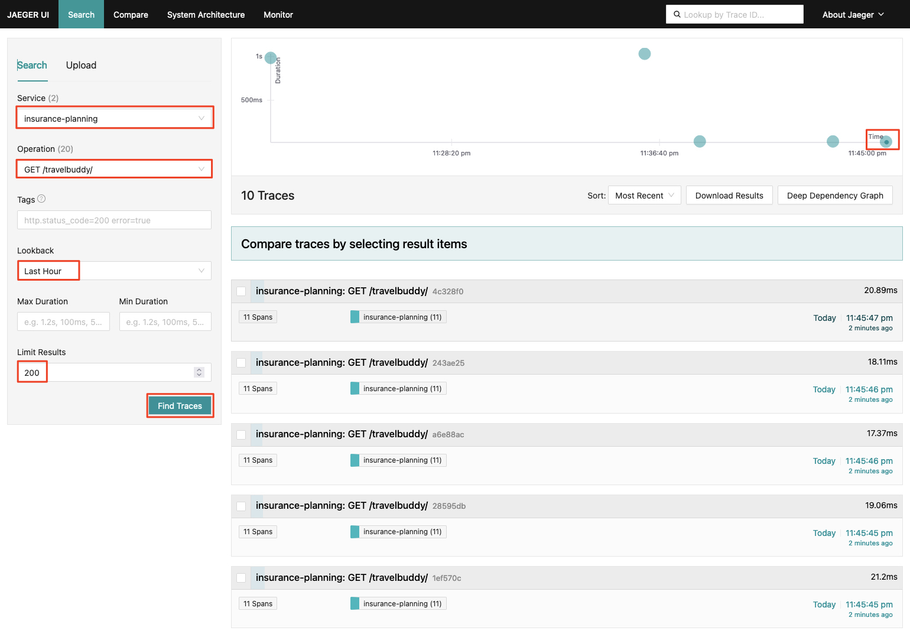

# `Jaeger`를 통한 분산 추적 (Distributed Tracing) 확인

`Jaeger`는 분산 추적 시스템으로, 애플리케이션의 성능을 모니터링하고 디버깅하는 데 사용됩니다. `Jaeger`는 OpenTracing API를 준수하며, 여러 언어로 작성된 애플리케이션에서 사용할 수 있습니다. `Jaeger`는 애플리케이션의 각 구성 요소 간의 상호 작용을 추적하고, 각 구성 요소의 성능을 측정하며, 각 구성 요소 간의 의존성을 시각화합니다.

`Jaeger`는 다음과 같은 주요 기능을 제공합니다:
* 분산 추적: 애플리케이션의 각 구성 요소 간의 상호 작용을 추적합니다.
* 성능 모니터링: 각 구성 요소의 성능을 측정합니다.
* 의존성 시각화: 각 구성 요소 간의 의존성을 시각화합니다.
* 루트 원인 분석: 애플리케이션의 성능 문제를 해결하는 데 도움이 됩니다.
* 통합: 여러 플랫폼과 프레임워크와 통합할 수 있습니다.
* 확장성: 대규모 분산 시스템에서 사용할 수 있습니다.
* 오픈 소스: 오픈 소스로 제공됩니다.
* 클라우드 네이티브: 클라우드 네이티브 환경에서 사용할 수 있습니다.

---

## 1. (Optional) `Jaeger` 설치 확인

`Jaeger`는 테라폼을 통해서 자원을 생성하면서 함께 생성/설치되었습니다.

아래 명령을 통해 `Jaeger` 설치에 사용된 테라폼 코드를 볼 수 있는데 진행자와 함께 살펴보도록 합니다.

```bash
c9 open ~/environment/legacy-application-modernization/infrastructure/terraform/modules/eks/eks-addons/observability/jaeger.tf
c9 open ~/environment/legacy-application-modernization/infrastructure/terraform/modules/eks/eks-addons/observability/jaeger-values.yaml
```


---

## 2. `Jaeger` 대시보드 확인 및 접속

아래 순서로 `Jaeger` URL을 확인하고 접속할 수 있습니다.

1. `Jaeger` 대시보드 URL 확인
```bash
# Jaeger 대시보드 URL 확인
echo "Jaeger 대시보드 URL: https://$(kubectl get ingress jaeger-query -n observability -o json | jq --raw-output '.status.loadBalancer.ingress[0].hostname')"
```


2. `Jaeger` 대시보드 접속

위에서 확인한 `Jaeger` 대시보드 URL을 브라우저에 입력하여 접속합니다.


---

## 3. 모놀리스 애플리케이션의 트레이스 (추적) 확인

우선 모놀리스 애플리케이션 화면에 접속하여 `Jaeger` 분산 추적을 확인해 보겠습니다.

1. 모놀리스 애플리케이션 접속

```bash
# 모놀리스 애플리케이션 URL 확인
echo "모놀리스 애플리케이션 URL: http://$(kubectl get ingress insurance-planning-ingress -n insurance -o json | jq --raw-output '.status.loadBalancer.ingress[0].hostname')/travelbuddy/"
```


2. `Jaeger` 분산 추적 확인

모놀리스 애플리케이션 화면에서 몇 차례 리프레시 하여 조회 요청을 발생시킨 후 `Jaeger` 대시보드에서 추적 정보를 확인합니다.

* "서비스": `insurance-planning`
* "Operation": `GET /travelbuddy/`
* "Limit Results": `200`
* "Find Traces" 버튼 클릭




위 추적 정보 화면에서 볼 수 있듯 모놀리스 화면 조회에 관련된 의존성 (데이터베이스)을 포함하여 상세한 추적 정보를 확인할 수 있습니다.

---

## 4. 모놀리스 애플리케이션의 추적 설정 둘러보기

여기서 한 가지 의문이 드실 수 있습니다.

> 🙋🏻‍♀️ 어떤 원리로 모놀리스 애플리케이션의 트레이스 정보가 `Jaeger`에 전달되는 걸까요?

1. 모놀리스 애플리케이션의 추적 설정 확인

모놀리스 애플리케이션 내부에서 추적 정보가 수집되는 원리는 `OpenTelemetry` 라이브러리를 사용하여 구현됩니다. 다음과 같은 형태로 구성할 수 있습니다.

* `OpenTelemetry` 라이브러리(SDK)를 사용하여 애플리케이션 코드에 추적 정보를 수집하는 코드를 추가합니다.
* 개발 언어를 지원하는 자동 계측 (`Auto Instrumentation`)을 사용하여 애플리케이션 내부에서 추적 정보가 자동으로 수집되도록 구성할 수 있습니다. 여기에는 다음과 같은 기술이 있습니다.
  * 바이트코드 조작 (Bytecode Instrumentation)
  * 몽키 패칭 (Monkey Patching)
  * eBPF (Extended Berkeley Packet Filter)

오늘 접하는 모놀리스 애플리케이션은 이 중에서 `Auto Instrumentation`을 사용하여 추적 정보를 수집하도록 구성되어 있습니다.

```bash
c9 open ~/environment/legacy-application-modernization/legacy/applications/TravelBuddy/helm/templates/otel-instrumentation.yaml

c9 open ~/environment/legacy-application-modernization/legacy/applications/TravelBuddy/helm/values.yaml
```


이 구성에서 가장 중요한 부분은 `spec.exporter.endpoint` 설정값이며, 이 값은 `OpenTelemetry` Collector의 서비스 주소를 가리키고 있으며 아래 다이어그램에서 왼쪽 위에 표시된 부분과 관련되어 있습니다.


2. `Instrumentation` CRD 객체
위에서 살펴본 객체는 `Insstrumentation` CRD 객체로, `OpenTelemetry` 수집된 추적 정보를 Collector에 전달하기 위한 설정을 포함하고 있습니다.


이 `Instrumentation CRD` 객체는 모놀리스 애플리케이션의 `Pod`가 생성될 때 `OpenTelemetry Operator`에 의해 `Mutating`되어 `OpenTelemetry` 라이브러리가 주입되며, 이를 통해 추적 정보가 수집되어 `OpenTelemetry Collector`에 전달됩니다.

아래 그림은 쿠버네테스의 `Mutating Webhook`을 통해 `OpenTelemetry Operator`가 `Collector`를 배포하는 과정을 보여주며, 이와 유사한 동작이 `Pod` 생성 시에도 수행됩니다.


3. `Mutated Pod` 확인

`OpenTelemetry Operator`에 의해 `Mutating`된 `Pod`를 `Describe`해 봄으로써 `OpenTelemetry` 라이브러리가 주입된 것을 확인할 수 있습니다. 


---

## 5. 서비스 간 (모놀리스 -> 마이크로서비스) 호출에 따른 분산 추적 확인

앞선 과정에서 잠깐 설명되었지만 우리는 다음과 같이 호출 경로에 따라 모놀리스 혹은 마이크로서비스로 요청을 분리하여 전달하게 구성되었습니다.

* `/travelbuddy/flightspecials/*`: `FlightSpecials` 마이크로서비스로 요청을 전달
* `/travelbuddy/*`: 모놀리스로 요청을 전달

즉, 기존에 모놀리스에서 처리하던 `/travelbuddy/flightspecials/*` 경로의 요청을 `FlightSpecials` 마이크로서비스로 분리하여 처리하도록 구성되었으므로 모놀리스 애플리케이션에서는 더 이상 항공권 사은품에 대한 요청을 처리하지 않습니다.

대신에 모놀리스 애플리케이션이 `/travelbuddy/flightspecials-old/{id}` 형태의 요청을 받으면 이를 `FlightSpecials` 마이크로서비스로 전달하도록 구성되어 있습니다.

이를 이용하여 서비스 간 호출을 수행해 보고 `Jaeger` 대시보드에서 분산 추적 정보를 확인할 수 있는지 살펴보겠습니다.

1. 모놀리스 애플리케이션을 통해 마이크로서비스 호출

```bash
# 모놀리스 -> 마이크로서비스 호출이 일어나는 요청 URL 확인
echo "모놀리스 -> 마이크로서비스 호출 요청 URL: http://$(kubectl get ingress insurance-planning-ingress -n insurance -o json | jq --raw-output '.status.loadBalancer.ingress[0].hostname')/travelbuddy/flightspecials-old/1"
```


위의 호출 화면을 몇 차레 리프레시한 후 `Jaeger` 대시보드에서 추적 정보를 확인합니다.

2. `Jaeger` 대시보드에서 분산 추적 확인

이번에는 "Operation"을 `GET /travelbuddy/flightspecials-old/{id}`로 설정하고 "Find Traces" 버튼을 클릭하여 추적 정보를 확인합니다.


위의 추적 정보 화면에서 볼 수 있듯 모놀리스 애플리케이션에서 마이크로서비스로 요청이 전달되는 과정을 상세히 확인할 수 있습니다.

---

# 🎊🎊🎊 `Jaeger`의 분산 트레이스 기능을 통해 애플리케이션의 성능을 모니터링하고 서비스 간 호출 관계를 추적하는 방법을 살펴보았습니다. 🎊🎊🎊
