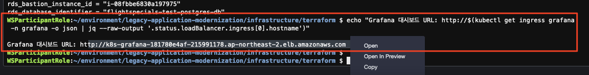
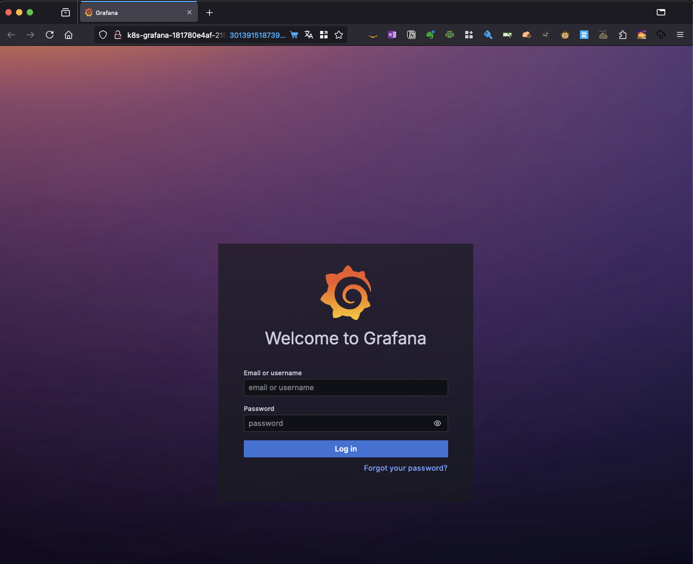
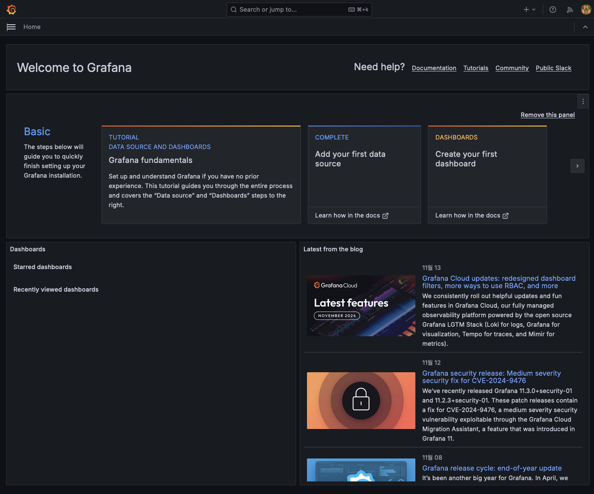
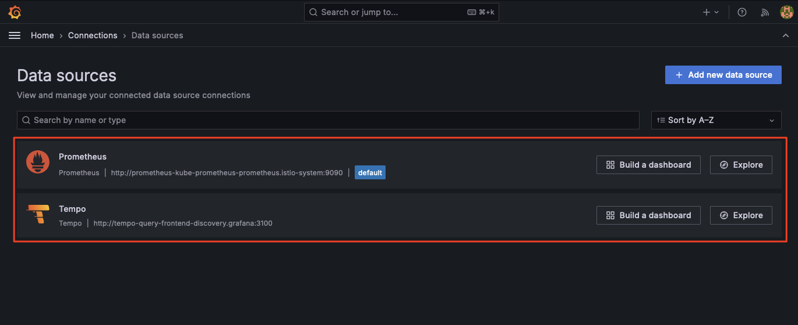
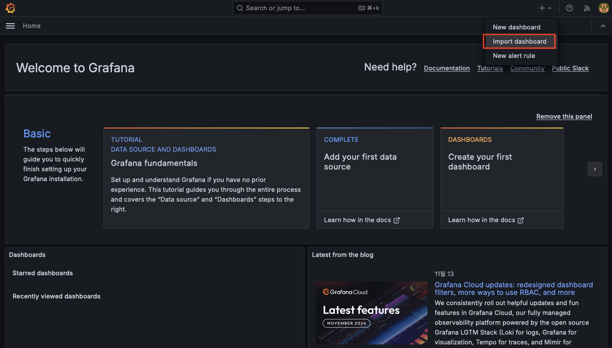
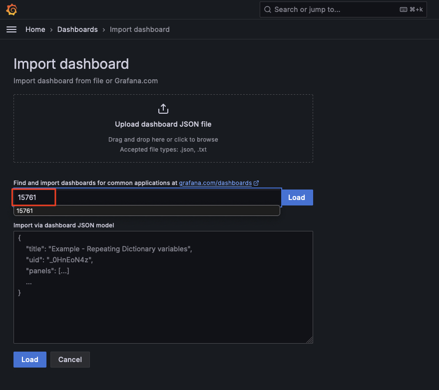
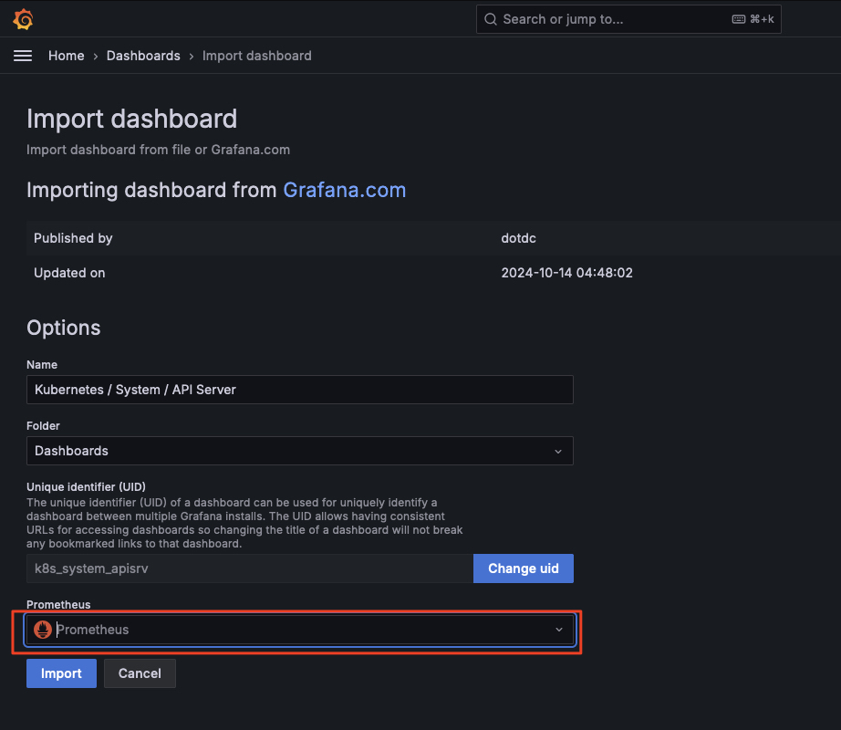
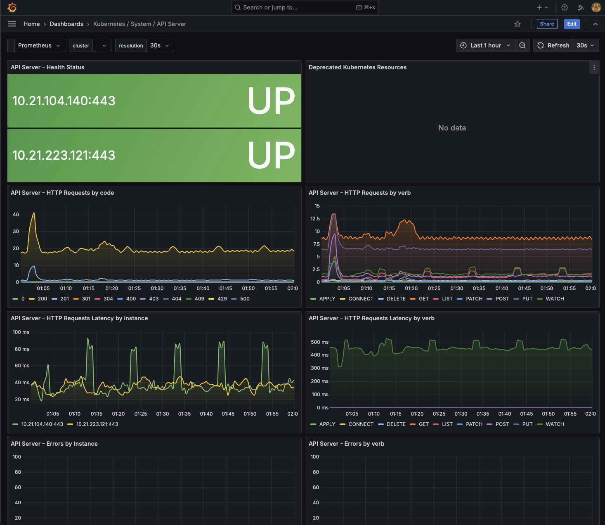

# ***`Grafana`틀 통한 모니터링***

이번 섹션에서는 `Grafana`를 통해 모니터링을 수행하는 방법에 대해 살펴보겠습니다.

---

## 1. `Grafana` 소개


`Grafana`는 여러 다양한 데이터 소스로부터 데이터를 수집하고 이를 대시보드로 시각화하는 오픈소스 모니터링 및 분석 플랫폼입니다. `Grafana`는 다양한 데이터 소스를 지원하며, 이를 통해 사용자는 여러 다양한 데이터 소스로부터 데이터를 수집하고 이를 대시보드로 시각화할 수 있습니다.

`Grafana`는 다음과 같은 특징을 가지고 있습니다:
* 다양한 데이터 소스 지원: `Prometheus`, `InfluxDB`, `Elasticsearch`, `MySQL`, `PostgreSQL`, `AWS CloudWatch`, `Azure Monitor`, `Google Cloud Monitoring` 등
* 대시보드 및 패널: 다양한 대시보드 및 패널을 통해 사용자가 원하는 데이터를 시각화할 수 있습니다.
* 플러그인 지원: `Grafana`는 다양한 플러그인을 지원하며, 이를 통해 사용자는 다양한 데이터 소스로부터 데이터를 수집하고 이를 대시보드로 시각화할 수 있습니다.
* 알람 통합: `Grafana`는 다양한 알람을 지원하며, 이를 통해 사용자는 데이터에 대한 알람을 설정하고 이를 통해 데이터에 대한 이상을 감지할 수 있습니다.

---

## 2. `Grafana` 대시보드 확인 및 접속

아래 순서로 `Grafana` URL을 확인하고 접속할 수 있습니다.

```bash
# Grafana 대시보드 URL 확인
echo "Grafana 대시보드 URL: http://$(kubectl get ingress grafana -n grafana -o json | jq --raw-output '.status.loadBalancer.ingress[0].hostname')"
```





사용자 이름과 암호는 다음 정보를 사용하여 접속합니다.

* 사용자 이름: `admin`
* 암호: `P@$$w0rd00#1`



그리고 아래와 같이 `Prometheus`와 `Tempo`가 데이터 소스로 등록되어 있는지 확인합니다.

* `Home` > `Configuration` > `Data Sources` 메뉴에서 `Prometheus`와 `Tempo`가 데이터 소스로 등록되어 있는지 확인합니다.

* 

---

## 3. 유용한 공개 대시보드 등록

오른쪽 위의 `Import dashboard` 기능을 통해 아래와 같은 공개 대시보드를 임포트합니다.

* `Kubernees API Server`: `15761`
* `Kubernetes CoreDNS`: `15762`
* `Kubernetes Global`: `15757`
* `Kubernetes Namespaces`: `15758`
* `Kubernetes Nodes`: `15759`
* `Kubernetes Pods`: `15760`










다른 대시보드에 대해서도 위 과정을 반복하여 임포트한 후 대시보드를 둘러봅니다.


[//]: # (## 4. 커스텀 대시보드 등록)

[//]: # ()
[//]: # (1. `Insurance Plannign 자바 힙 메모리` 상태 모니터링 대시보드)

[//]: # ()
[//]: # (아래와 같이 커스텀 대시보드 파일을 엽니다.)

[//]: # ()
[//]: # (```bash)

[//]: # (c9 open ~/environment/legacy-application-modernization/observability/grafana/\&#40;insurance-planning\&#41;\&#40;Large\ Memory\ Java\&#41;\ JVM\ Metrics\ v2.json)

[//]: # (```)

[//]: # ()
[//]: # (2. 열린 파일을 클립보드에 복사합니다.)

[//]: # ()
[//]: # (3. 아래와 같이 대시보드를 등록합니다.)

[//]: # ()
[//]: # (![Import Custom Dashboard]&#40;../../images/Observability/Import-Custom-Dashboard.png&#41;)

---

# 🎊🎊🎊 쿠버네테스 클러스터를 모니터링하기 위한 기본적인 대시보드를 그라파나로 임포트하고 살펴보았습니다. 🎊🎊🎊 
