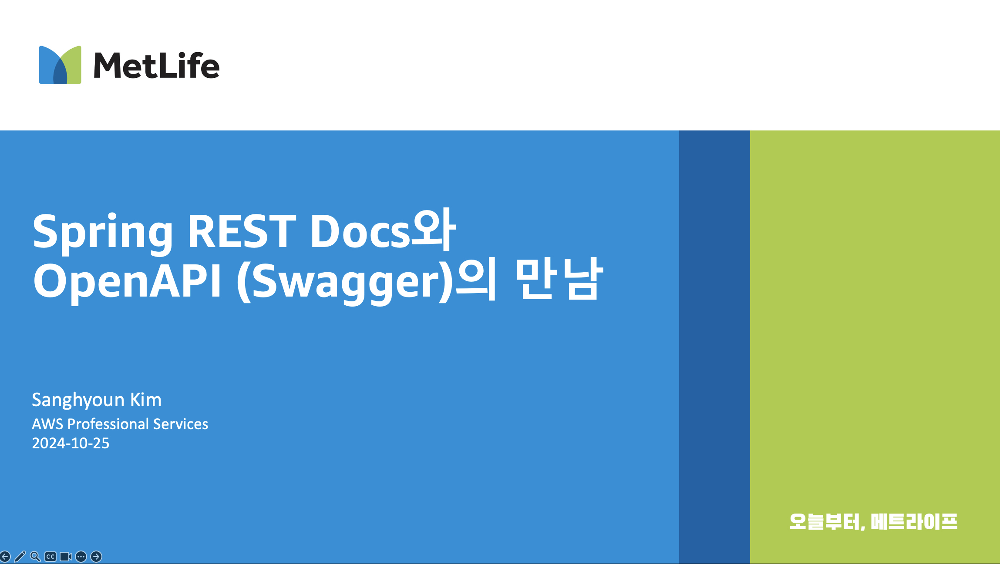

# ***API 문서화***

마이크로서비스는 필요에 따라 크게 `Event-Driven`과 `API-Driven (RESTful)` 방식으로 소통하게 됩니다.

이 중 `API-Driven` 방식으로 소통하는 마이크로서비스 호출의 경우, `API 문서화`가 필수적입니다. `API 문서화`는 API를 사용하는 사용자에게 API의 사용법을 제공하고, API를 사용하는 데 필요한 정보를 제공하는 것입니다.

이번 섹션에서는 `Spring RestDoc`과 `OpenAPI`를 결합하여 API 문서화를 수행하는 방법을 살펴보겠습니다.

> 📕 (참고) 
> `Spring RestDoc`과 `OpenAPI`에 대해서 기본적인 사항을 정리한 문서를 아래 링크에서 찾을 수 있습니다. 
> * [[Spring RestDoc과 OpenAPI의 만남 소개]](https://legacy-application-modernization.s3.ap-northeast-2.amazonaws.com/Mixing-RestDoc-and-OpenAPI-Swagger.pptx) 
> 
