# ***Spring RestDoc과 OpenAPI 결합하기***

앞서 설명한 바와 같이, `Spring RestDoc`과 `OpenAPI`를 결합하여 API 문서화를 수행하는 방법을 살펴보겠습니다.

구체적으로 다음과 같은 형태로 구성되어 있습니다.
* 간단한 `REST API`를 가지는 `Gradle` 애플리케이션
* 빌드 파이프라인을 통해 빌드가 수행되고, 단위 테스트 (`Spring REST Docs MockMvc`)가 수행됩니다.
* 단위 테스트가 성공하면 `OpenAPI` 문서가 생성되고, 이 문서를 내장하는 `Swagger UI Pod`를 별도로 배포합니다.

---

## 1. 예제 애플리케이션 `GitOps` 리포지터리 초기화

1. `Cloud9` 터미널 창에서 다음 명령을 실행하여 `GitOps` 리포지터리를 초기화합니다.

```bash
cd ~/environment/legacy-application-modernization
rm -rf .git || true

# 어플리케이션 Helm Artifact 경로로 이동
cd ~/environment/legacy-application-modernization/modernization/applications/restdoc-openapi/helm

# Git 연결
git init
git branch -M main

# GitOps 리포지터리 URL 확인
export HELM_CODECOMMIT_URL=$(aws codecommit get-repository --repository-name restdoc-openapi-configuration --region ap-northeast-2 | grep -o '"cloneUrlHttp": "[^"]*' | grep -o '[^"]*$')
echo $HELM_CODECOMMIT_URL

# GitOps 배포 리포지터리와 연결
git remote add origin $HELM_CODECOMMIT_URL

# Git 스테이징 영역에 파일을 추가
git add .

# GitOps 리포지터리에 Push합니다.
git commit -am "First commit."
git push --set-upstream origin main
```

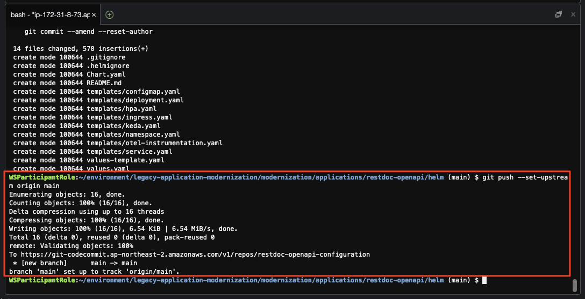

## 2. `ArgoCD` `GitOps` 리포지터리 생성

예제 애플리케이션의 `GitOps` 리포지터리를 `ArgoCD`에 연결합니다.

```bash
export ARGOCD_ADMIN_PASSWORD_SECRET_ID=restdoc-openapi-ci-argocd-admin-password

# GitOps 리포지터리 URL 확인
export HELM_CODECOMMIT_URL=$(aws codecommit get-repository --repository-name restdoc-openapi-configuration --region ap-northeast-2 | grep -o '"cloneUrlHttp": "[^"]*' | grep -o '[^"]*$')
echo $HELM_CODECOMMIT_URL

# ArgoCD Server URL
export ARGOCD_SERVER=`kubectl get ingress/argocd-server -n argocd -o json | jq --raw-output '.status.loadBalancer.ingress[0].hostname'`
echo "ARGOCD_SERVER: ${ARGOCD_SERVER}"

# AWS Secrets Manager로 부터 ArgoCD admin 암호 조회
export ARGOCD_ADMIN_PASSWORD=`aws secretsmanager get-secret-value --secret-id $ARGOCD_ADMIN_PASSWORD_SECRET_ID --query SecretString --output text`

# ArgoCD 서버에 로그인
argocd login ${ARGOCD_SERVER} --username admin --password ${ARGOCD_ADMIN_PASSWORD} --insecure --grpc-web

# IAM User 생성 - 이 과정은 이전에 한번 수행하여 꼭 필요하지는 않지만 스크립트 완전성을 위해 추가
aws iam create-user --user-name argocd3
aws iam attach-user-policy --user-name argocd3 --policy-arn arn:aws:iam::aws:policy/AWSCodeCommitPowerUser
OUTPUT=$(aws iam create-service-specific-credential --user-name argocd3 --service-name codecommit.amazonaws.com)
export SERVICE_USER_NAME=$(echo $OUTPUT | jq -r '.ServiceSpecificCredential.ServiceUserName') && echo $SERVICE_USER_NAME
export SERVICE_PASSWORD=$(echo $OUTPUT | jq -r '.ServiceSpecificCredential.ServicePassword') && echo $SERVICE_PASSWORD

# GitOps 리포지터리 추가
# (참고) 위에서 설정했던 GitOps 리포지터리의 Credential은 Eventual Consistency 때문에 아래 명령 수행 시 에러가 발생할 수 있습니다.
# 이 경우 잠시 기다린 후 다시 시도하거나 수행을 반복하도록 구성합니다.
# Eventual Consistency는 클라우드 네이티브의 특성 중 하나로, 리소스 생성 후 일정 시간이 지나야 리소스가 사용 가능한 상태가 되는 것을 의미합니다. 
for i in {1..10}; do
  argocd repo add $HELM_CODECOMMIT_URL --username $SERVICE_USER_NAME --password $SERVICE_PASSWORD --type git --project default && break
  echo "Attempt $i failed, retrying in 5 seconds..."
  sleep 5
done
```

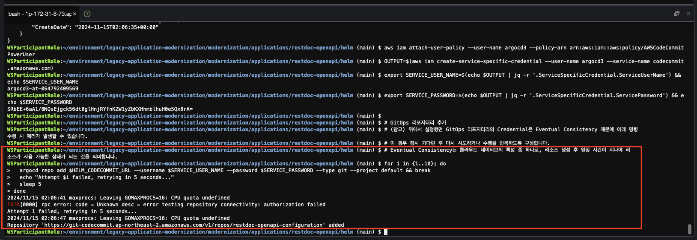

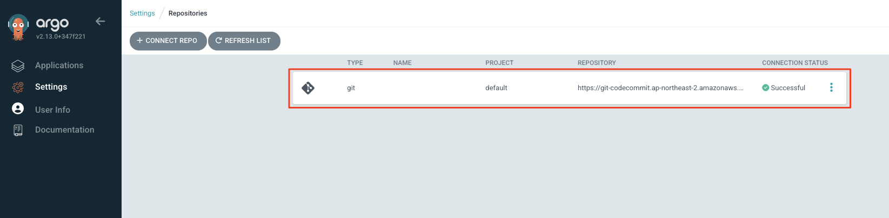

---

## 3. `ArgoCD` 애플리케이션 생성 - `Spring REST Docs + OpenAPI` 예제 애플리케이션

`ArgoCD CLI`를 통해 `Spring REST Docs + OpenAPI` 예제 애플리케이션을 생성합니다.

```bash
# ArgoCD CLI를 사용하여 애플리케이션 추가
argocd app create restdoc-openapi --repo $HELM_CODECOMMIT_URL --path "." --dest-server https://kubernetes.default.svc --dest-namespace restdoc-openapi --sync-policy manual --project default
```

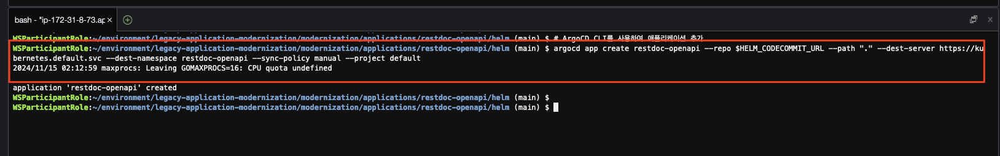

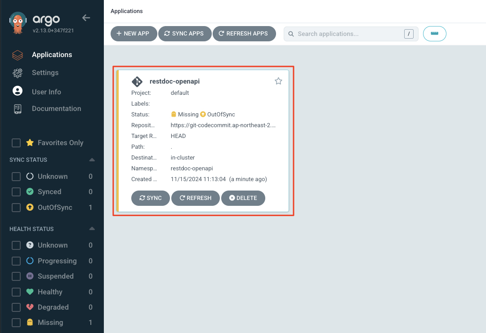

> 📒️ (참고)<br>
> `ArgoCD`에서 애플리케이션이 생성되면 아직 동기화가 되지 않았으므로 `OutOfSync`로 표시됩니다.<br>
> 이후 설정할 빌드 파이프라인이 잘 수행되면 `ArgoCD`에서 애플리케이션 배포가 자동으로 수행되고 `Synced`로 표시됩니다.

---

## 4. `Spring REST Docs + OpenAPI` 예제 애플리케이션 빌드

1. 소스 리포지터리 커밋 및 빌드 파이프라인 실행

```bash
# 어플리케이션 소스 경로로 이동
cd ~/environment/legacy-application-modernization/modernization/applications/restdoc-openapi/build/

# Git 연결
git init
git branch -M main

# 리모트 Git 리포지터리 주소 획득
export BUILD_CODECOMMIT_URL=$(aws codecommit get-repository --repository-name restdoc-openapi-application --region ap-northeast-2 | grep -o '"cloneUrlHttp": "[^"]*'|grep -o '[^"]*$')
echo $BUILD_CODECOMMIT_URL

# 리모트 Git 리포지터리 연결
git remote add origin $BUILD_CODECOMMIT_URL

# Git 스테이징 영역에 파일을 추가
git add .

# Commit 및 Push합니다.
git commit -am "First commit."
git push --set-upstream origin main
```

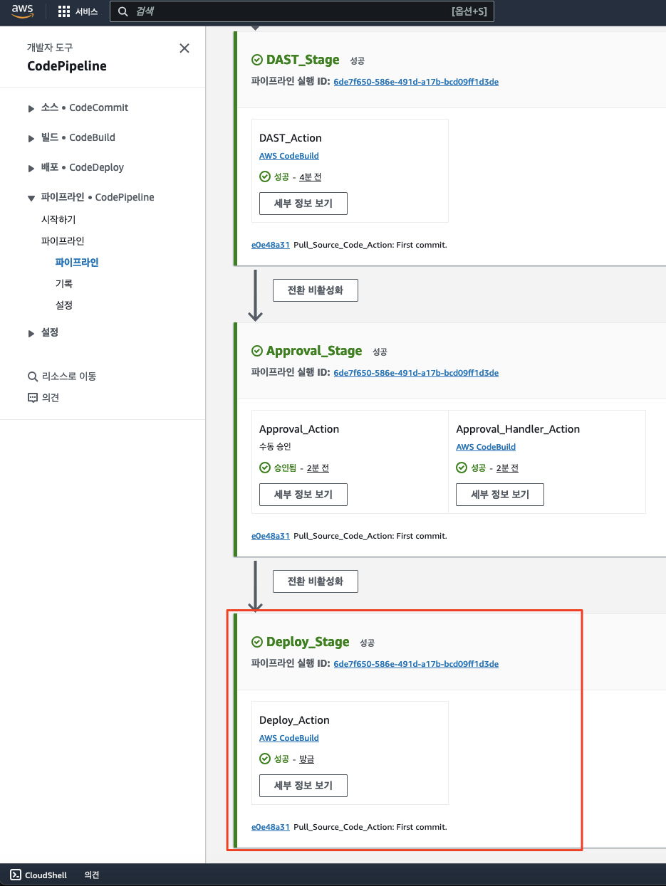

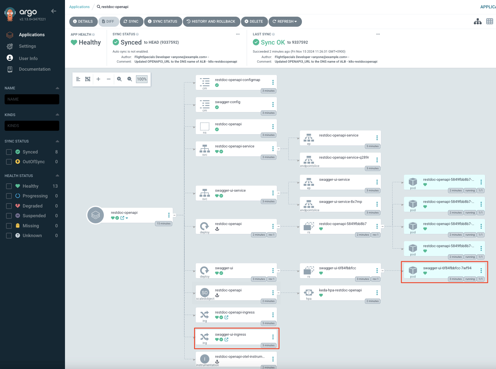

---

## 5. `Spring REST Docs + OpenAPI` `Swagger` UI 접속

```bash
# `Swagger UI` Ingress URL 확인
export SWAGGER_UI_URL=`kubectl get ingress/swagger-ui-ingress -n restdoc-openapi -o json | jq --raw-output '.status.loadBalancer.ingress[0].hostname'`
echo "Swagger UI URL: http://${SWAGGER_UI_URL}/swagger-ui/"
```

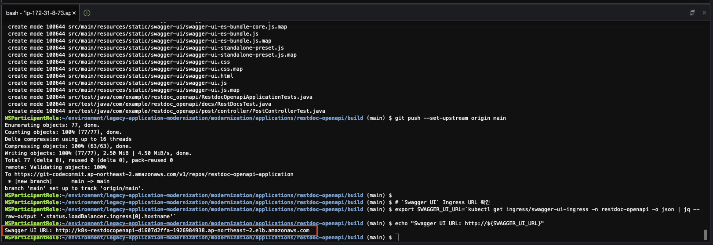

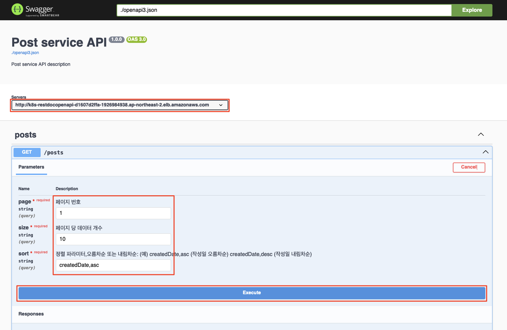

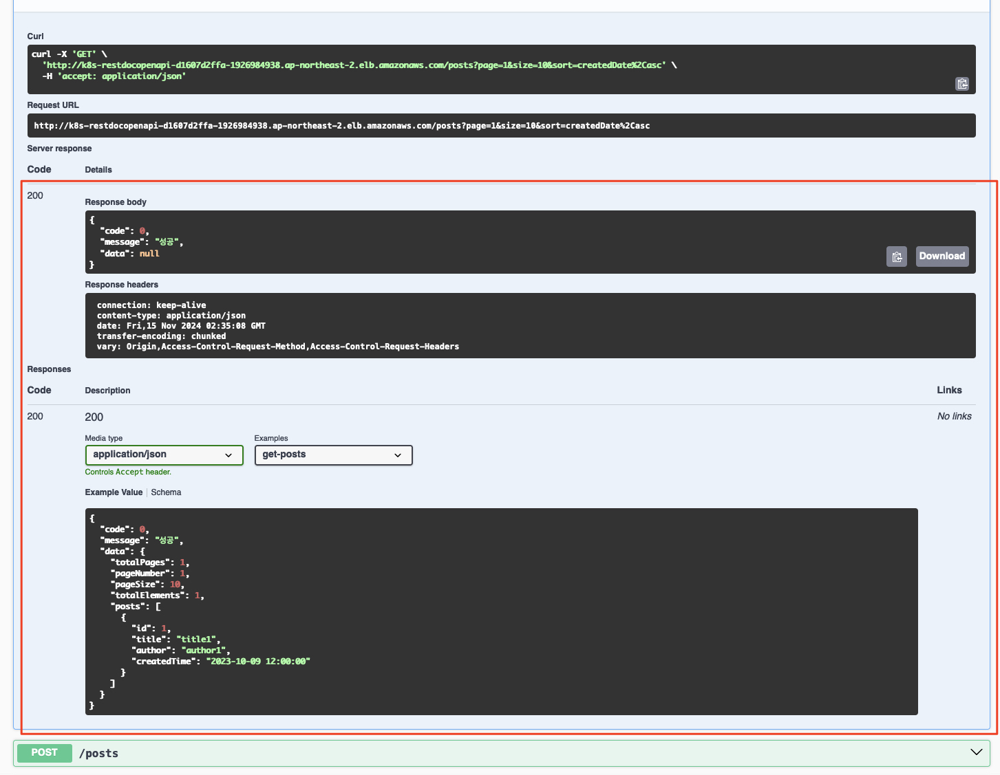

---

## 6. 로컬 빌드

로컬에서도 빌드 및 실행이 가능합니다.

1. 소스 빌드

```bash
export RDS_BASTION_INSTANCE_ID=`aws ec2 describe-instances --filters "Name=tag:Name,Values=RDS-Bastion" --query 'Reservations[*].Instances[*].[InstanceId]' --output text` && echo $RDS_BASTION_INSTANCE_ID
aws ssm start-session --target $RDS_BASTION_INSTANCE_ID

bash
cd ~

# 인스턴스에 설치한 패키지 및 패키지 캐시를 업데이트
sudo yum update -y
# 최신 Docker Engine 패키지를 설치
sudo amazon-linux-extras install docker -y
# Tooling 설치
sudo yum install -y git
sudo yum install -y java-17-amazon-corretto-headless

# Docker 서비스를 시작
sudo service docker start

# 시스템이 재부팅될 때마다 Docker 대몬이 시작되도록 하려면 다음 명령을 실행
sudo systemctl enable docker

# sudo를 사용하지 않고도 Docker 명령을 실행할 수 있도록 docker 그룹에 ec2-user를 추가
sudo usermod -a -G docker ec2-user
sudo usermod -a -G docker ssm-user

# 만일 docker를 실행했을 때 권한 오류가 발생하면 docker 그룹으로 Change
newgrp docker

docker ps

git clone https://github.com/shkim4u/legacy-application-modernization legacy-application-modernization
cd legacy-application-modernization/modernization/applications/restdoc-openapi/build

./gradlew clean copyOasToSwagger
./gradlew bootJar --build-cache -x test
```

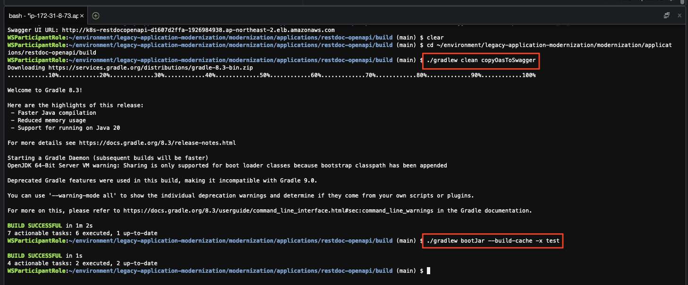

2. 컨테이너 이미지 빌드
```bash
docker build -t restdoc-openapi .
```

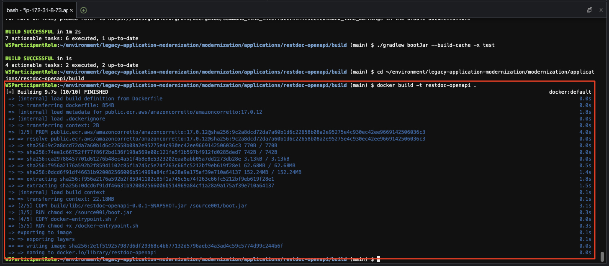

3. 컨테이너 실행

```bash
docker run --rm -p 8080:8080 -t restdoc-openapi:latest
```

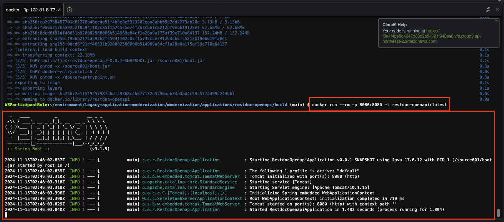

4. `Swagger UI` 접속

* 로컬에서 접속 시
http://localhost:8080/swagger-ui/swagger-ui.html

* 클라우드 환경에서 접속 시 (EC2)
http://[EC2 Public IP]:8080/swagger-ui/swagger-ui.html


5. `OAS` 파일 로딩

http://localhost:8080/openapi3.json


