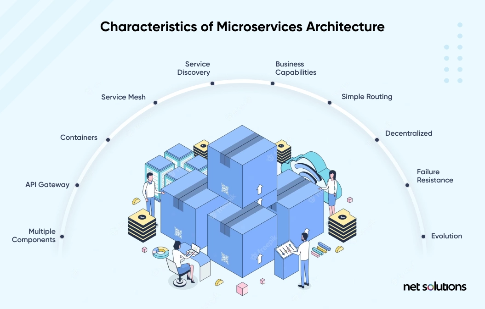
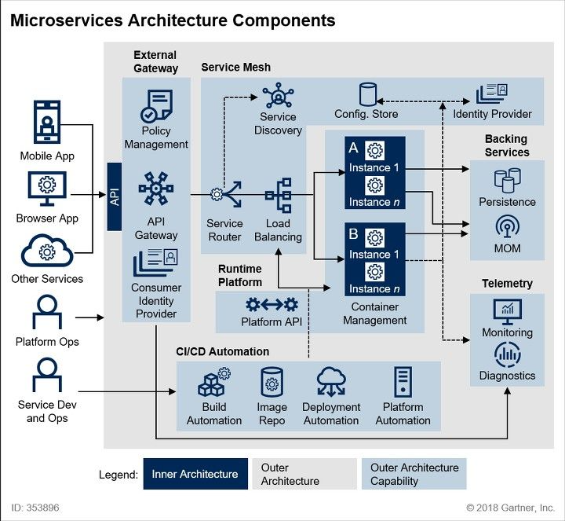

# ***모더나이제이션 워크샵***

---

## 목차

* [마이크로서비스 아키텍처 및 워크샵의 목적](README.md)
* [환경 설정](setup-environment/Setup-Environment-README.md)
  * [공통 설정](setup-environment/Setup-Common-Configuration.md)
  * [소스 환경 구성](setup-environment/Setup-Source-Environment.md)
  * [타겟 환경 구성](setup-environment/Setup-Target-Environment.md)
  * [소스/타겟 연결 구성](setup-environment/Setup-Source-Target-Connectivity.md)

---
## 워크샵의 목적 및 마이크로서비스 아키텍처 소개

이번 워크샵은 애플리케이션의 현대화라는 전사적인 IT 묙표를 달성하기 위한 구현 패턴 중 하나인 마이크로서비스 아키텍처를 살펴볼 예정입니다. 마이크로서비스 아키텍처는 애플리케이션을 여러 작은 서비스로 분할하여 개발, 배포 및 확장을 단순화하고, 서비스 간의 결합도를 낮추어 유연성을 높이는 아키텍처 패턴입니다. 마이크로서비스 아키텍처는 다음과 같은 특징을 가지고 있습니다:  

위 그림은 마이크로서비스 아키텍처의 주요 구성 요소와 이의 주된 특징을 표현하고 있습니다. 각 특징을 간단히 설명하면 다음과 같습니다:
* Service Discovery: 서비스 간 통신을 위한 동적 위치 파악
* Business Capabilities: 비즈니스 기능 중심의 서비스 설계
* Simple Routing: 간단한 라우팅 메커니즘
* Decentralized: 분산된 서비스 관리 및 데이터 저장
* Failure Resistance: 장애 대응 능력
* Evolution: 지속적인 개선 및 업데이트 가능성
* Multiple Components: 여러 독립적 구성 요소로 구성
* API Gateway: 중앙 진입점으로 API 관리
* Containers: 컨테이너 기술을 이용한 배포
* Service Mesh: 서비스 간 통신 인프라 제공

이들이 결합된 마이크로서비스 아키텍처의 예는 다음과 같습니다.

오늘은 특히 이러한 마이크로서비스 아키텍처 중 우리들의 비즈니스 로직과 그 구현체인 이너 아키텍처가 담기게 될 외부 아키텍처를 직접 생성해 보고 접해보고자 합니다.

구체적으로 다음과 같은 구성 요소를 접하게 됩니다:
1. 쿠버네테스 및 이미지 레지스트리
  * 쿠버네테스 클러스터
  * 노드 오토스케일러 (Karpenter)
  * `HPA (Horizontal Pod Autoscaler)` 및 `Keda (Kubernetes Event-driven Autoscaler)`
2. 데이터베이스 및 이벤트 브로커: MySQL, PostgreSQL, Apache Kafka
  * (Note) `Apache Kafka`는 시간 관계 상 생성만 되고 사용되지는 않습니다.
3. 애플리케이션 로드 밸런서
4. CI/CD: CI 파이프라인 및 GitOps (ArgoCD)
  * (Note) CI 파이프라인의 경우, 외부 아키텍처를 접하는 워크샵의 목적에 좀 더 집중하고자 별도의 브랜치 전략은 적용되지 않았으며, `main` 브랜치에 직접 푸시하여 애플리케이션이 배포되도록 설정되어 있습니다.
5. Observability: Prometheus, Grafana, Jaeger
6. 데모 애플리케이션
7. 테라폼을 통한 인프라스트럭처 관리

---
