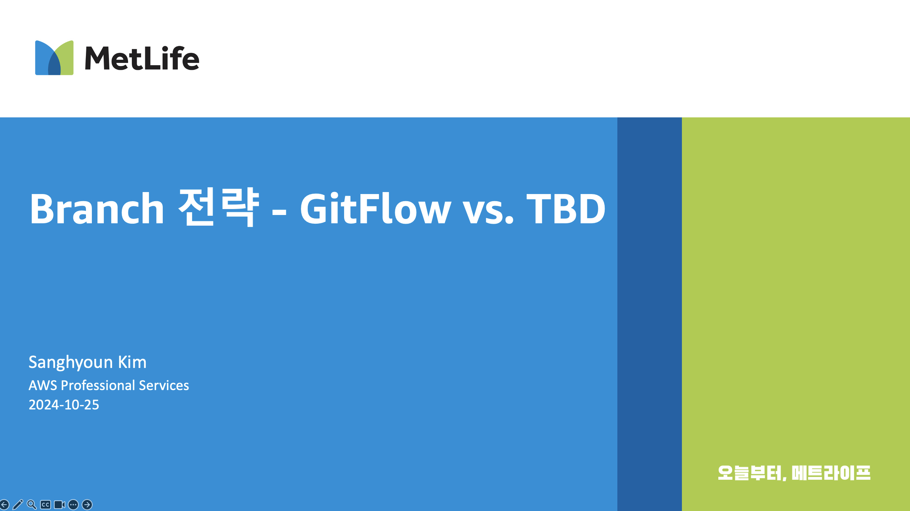
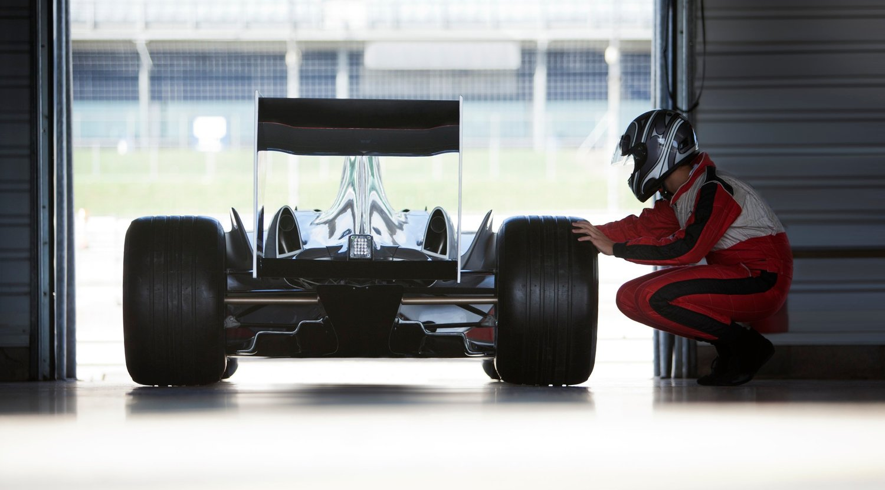

# ***모더나이제이션 워크샵***

---

## 목차

* [애플리케이션 현대화 및 워크샵의 목적](README.md)
* [환경 설정 개요](01-Setup-Environment/00-Setup-Environment-README.md)
    * [환경 설정](01-Setup-Environment/01-Provision-Workshop-Environment.md)
* [모놀리스 애플리케이션 배포](02-Deploy-Monolith-Application/00-Monolith-Application-README.md)
    * [모놀리스 데이터베이스 구성](02-Deploy-Monolith-Application/01-Configure-Monolith-Database.md)
    * [모놀리스 배포를 위한 GitOps설정](02-Deploy-Monolith-Application/02-Configure-GitOps.md)
    * [모놀리스 애플리케이션 빌드 및 배포](02-Deploy-Monolith-Application/03-Build-and-Deploy.md)
* [마이크로서비스 분리](03-Deploy-Microservice/00-Microservices-README.md)
    * [마이크로서비스 배포를 위한 GitOps 설정](03-Deploy-Microservice/01-Configure-GitOps.md)
    * [마이크로서비스 빌드 및 배포](03-Deploy-Microservice/02-Build-and-Deploy.md)
* [가시성 (Observability)](04-Observability/00-Observability-README.md)
    * [Jaeger를 이용한 분산 추적](04-Observability/01-Jaeger.md)
    * [Grafana 대시보드](04-Observability/02-Grafana.md)
* [API 명세 및 문서화](05-API-Documentation/00-API-Documentation-README.md)
    * [Spring RestDoc과 OpenAPI의 결합](05-API-Documentation/01-Spring-RestDoc-OpenAPI.md)

위에 기술되어 있지 않지만 시간 상황에 따라 추가될 수 있는 주제들은 다음과 같습니다:
* `Gatling`을 이용한 부하 테스트 자동화
* `KEDA (Kubernetes Event-driven Autoscaler)`를 이용한 이벤트 기반 Pod 자동 스케일 아웃
* `Groupless Cluster Autoscaler`인 `Karpenter`를 활용한 노드 자동 확장
  * 스케쥴된 스케일 아웃
  * 부하 시 스케일 아웃

---

## 애플리케이션 현대화 개요와 워크샵의 목적

이번 워크샵은 애플리케이션의 현대화라는 전사적인 IT 묙표를 달성하기 위한 구현 패턴 중 하나인 마이크로서비스 아키텍처를 살펴볼 예정입니다. 마이크로서비스 아키텍처는 애플리케이션을 여러 작은 서비스로 분할하여 개발, 배포 및 확장을 단순화하고, 서비스 간의 결합도를 낮추어 유연성을 높이는 아키텍처 패턴입니다. 마이크로서비스 아키텍처는 다음과 같은 특징을 가지고 있습니다:  

위 그림은 마이크로서비스 아키텍처의 주요 구성 요소와 이의 주된 특징을 표현하고 있습니다. 각 특징을 간단히 설명하면 다음과 같습니다:
* Service Discovery: 서비스 간 통신을 위한 동적 위치 파악
* Business Capabilities: 비즈니스 기능 중심의 서비스 설계
* Simple Routing: 간단한 라우팅 메커니즘
* Decentralized: 분산된 서비스 관리 및 데이터 저장
* Failure Resistance: 장애 대응 능력
* Evolution: 지속적인 개선 및 업데이트 가능성
* Multiple Components: 여러 독립적 구성 요소로 구성
* API Gateway: 중앙 진입점으로 API 관리
* Containers: 컨테이너 기술을 이용한 배포
* Service Mesh: 서비스 간 통신 인프라 제공

이들이 결합된 마이크로서비스 아키텍처의 예는 다음과 같습니다.

오늘은 특히 이러한 마이크로서비스 아키텍처 중 우리들의 비즈니스 로직과 그 구현체인 이너 아키텍처가 담기게 될 외부 아키텍처를 직접 생성하면서 접해보고자 합니다.

구체적으로 다음과 같은 구성 요소를 접하게 됩니다:
1. 쿠버네테스 및 이미지 레지스트리
   * 쿠버네테스 클러스터
   * 노드 오토스케일러 (Karpenter)
   * `HPA (Horizontal Pod Autoscaler)` 및 `Keda (Kubernetes Event-driven Autoscaler)`
2. 데이터베이스 및 이벤트 브로커: MySQL, PostgreSQL, Apache Kafka
   * (Note) `Apache Kafka`는 시간 관계 상 생성만 되고 사용되지는 않습니다.
3. 애플리케이션 로드 밸런서
4. CI/CD: CI 파이프라인 및 GitOps (ArgoCD)
   * (Note) CI 파이프라인의 경우, 외부 아키텍처를 접하는 워크샵의 목적에 좀 더 집중하고자 별도의 브랜치 전략은 적용되지 않았으며, `main` 브랜치에 직접 푸시하여 애플리케이션이 배포되도록 설정되어 있습니다.
   * 브랜치 전략에 대한 내용은 [[브랜치 전략 - GitFlow vs. TBD]](https://legacy-application-modernization.s3.ap-northeast-2.amazonaws.com/Branch-Strategy-GitFlow-vs-TBD-F.pptx)를 참고하시기 바랍니다. 
   * 
5. Observability: Prometheus, Grafana, Jaeger
6. 데모 애플리케이션
7. 테라폼을 통한 인프라스트럭처 관리

---

## 자동화와 기계적 공감 (Mechanical Sympathy) 사이의 균형

이번 워크샵은 자동화와 기계적 공감 사이의 균형을 맞추는 것을 염두에 두고 제작되었습니다.

* `자동화 (Automation)`: 효율성을 높이기 위해 대부분의 자원을 `IaC` 도구를 사용하여 생성하도록 자동화하였습니다. 이는 시간을 절약하고 입력 오류를 줄이는 데 도움이 됩니다.
* `기계적 공감 (Mechanical Sympathy)`: 모든 부분을 자동화하면 시스템의 기본 작동 원리를 이해하기가 어렵습니다. 몇몇 부분은 수동으로 조작해 봄으로써 어떤 기술적인 원리가 있는지 살펴볼 수 있는 기회가 되도록 구성해 보았습니다.
